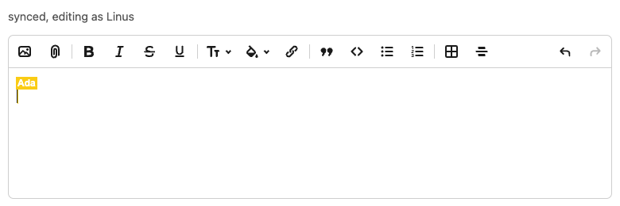

# yrby

[](https://github.com/jpcamara/yrby/actions/workflows/ci.yml)

Collaborative editing for Rails, backed by [y-crdt](https://github.com/y-crdt/y-crdt)
(the Rust library behind Y.js). Your Rails server speaks the y-websocket sync
protocol directly, so there's no separate Node process hosting the Y.js
documents. Pronounced "yer-bee".



```ruby
class DocumentChannel < ApplicationCable::Channel
  include Y::ActionCable::Sync

  on_load   { |key|         MyStore.load(key) }
  on_change { |key, update| MyStore.append(key, update) }

  def subscribed    = sync_subscribed(params[:id])
  def receive(data) = sync_receive(data, params[:id])
end
```

On the browser, use the `ActionCableProvider` from the 
[`yrby-client`](https://www.npmjs.com/package/yrby-client) npm package.
Integrates with any editor that includes Y.js support, such as Tiptap, ProseMirror
and [Lexxy](https://www.npmjs.com/package/lexxy-realtime).

## Usage

Install the gem and npm package:

```
gem install yrby-actioncable # depends on yrby
npm install yrby-client
```

## What you get

- A thread-safe Ruby `Doc` you can share across Ruby threads/fibers, and native CRDT work
  runs with the GVL released.
- The y-websocket protocol (document sync plus awareness/presence) as a
  one-include ActionCable concern.
- Authoritative record-before-distribute semantics: each document change can be
  recorded durably before it goes out to anyone.
- Optional server-side reads: `Doc#read_text` and `Doc#read_map` reconstruct a
  document's contents in Ruby - no Node process - for search, exports, validation,
  or server-side rendering.

## Scope

`yrby` binds just the part of `y-crdt` you need to *sync and persist* collaborative
documents - a `Doc`, awareness, and the y-websocket protocol primitives. By default
the Ruby side treats a document as opaque CRDT state: it applies updates, answers
sync handshakes, and records deltas without reaching into the contents - the browser
editor owns the document's shape. When you do need to look inside, `Doc#read_text`
and `Doc#read_map` reconstruct it server-side, in Ruby.

## Durability and delivery

The surface is intentionally small, but the focus is durability, resiliency, delivery
guarantees, correctness, and thread safety.

Towards that goal, `yrby` adds capabilities that stand out even in the Yjs ecosystem:

- Built-in update acknowledgement: the `ActionCableProvider` in `yrby-client` will continue to
  send updates until an ack is received from the server. [`yrby-actioncable`](https://rubygems.org/gems/yrby-actioncable)
  only sends an ack when applying an update is successful. The goal is at-least-once delivery,
  and because CRDTs are idempotent a duplicate update is effectively a no-op.
- Gap detection in document updates: before applying an update and sending an ack to the client,
  `yrby` checks whether the update results in any causal gap. Ie, an update comes through
  which depends on a previous update that is not yet present in the document. This can result in
  a document stuck with "pending" updates, which will _never_ apply if the missing update is not sent.
  To avoid this, `yrby` does not apply the update, and starts a new y-protocol sync with the client.
  That will cause the client to synchronize its document with the server, sending through any updates
  that may have been missed

## What about [yrb](https://github.com/y-crdt/yrb)?

`yrb` has a much larger interface that gives you most of the Yjs type system - 
shared text, arrays, maps, XML - to build and query documents in Ruby. It was a great
inspiration for my use of Yjs in Ruby/Rails, and I originally considered building
on top of it. There are a few reasons I went with `yrby` instead:

- `yrb` is largely unmaintained. It was built as an experiment for GitLab, and the original
  author mostly moved onto other projects.
- [It isn't thread-safe](https://github.com/y-crdt/yrb/issues/72). It segfaults in a threaded
  environment (such as ActionCable...)
- It's a much larger set of features to maintain, which most people don't need. The vast
  majority of people manipulate Y.js documents in the browser, not from a server-side language.

## Testing

Ruby and Rust unit tests cover the core. CI also runs the npm client tests and a
Rails demo smoke slice against the real ActionCable stack. The demo includes
heavier local suites for hostile input, crash recovery, multi-browser editing,
AnyCable, and load testing. The benchmark note below is from a single laptop.
Issues and PRs are welcome.

## Install

```ruby
# Core CRDT + protocol primitives:
gem "yrby"

# For the Rails/ActionCable server concern (Y::ActionCable::Sync):
gem "yrby-actioncable"
```

Requires Ruby 3.4 or newer. The release workflow builds precompiled gems for
Ruby 3.4 and 4.0 across the supported Ruby platforms, with native smoke tests
on Linux x86_64 and macOS arm64. Installing from a matching platform gem needs
no Rust; a source build needs [Rust](https://rustup.rs).

To work on the gem itself:

```bash
git clone https://github.com/jpcamara/yrby
cd yrby
bundle install
bundle exec rake compile test
```

The rest of the dev setup, plus the demo, is in [CONTRIBUTING.md](CONTRIBUTING.md).

## Docs

- The ActionCable concern and a quickstart are [below](#actioncable-integration).
- [`examples/actioncable-demo`](examples/actioncable-demo): a runnable Rails +
  Tiptap app with collaborative cursors, the AnyCable setup, a Postgres store,
  and the test/load suites.
- [CHANGELOG.md](CHANGELOG.md) and [CONTRIBUTING.md](CONTRIBUTING.md).

## Editors

yrby syncs opaque Yjs updates, so it works with any editor that has a Yjs
binding. The demo app runs four, and CI drives each one in real Chrome:
concurrent typing with every keystroke accounted for, remote cursors,
local-only undo, and byte parity between the server-side renderers and the
editor's own serializer. Each page is a working integration to copy from:

| Editor | Yjs binding | Demo code |
|---|---|---|
| [Tiptap](https://tiptap.dev) (v2) | `@tiptap/extension-collaboration` | [`app.js`](examples/actioncable-demo/frontend/src/app.js) |
| [Lexxy](https://github.com/basecamp/lexxy) (Lexical) | [`lexxy-realtime`](https://www.npmjs.com/package/lexxy-realtime) | [`lexxy.js`](examples/actioncable-demo/frontend/src/lexxy.js) |
| [Rhino Editor](https://github.com/KonnorRogers/rhino-editor) (Tiptap 3) | `@tiptap/extension-collaboration` + `-caret` | [`rhino.js`](examples/actioncable-demo/frontend/src/rhino.js) |
| [CodeMirror 6](https://codemirror.net) | `y-codemirror.next` | [`codemirror.js`](examples/actioncable-demo/frontend/src/codemirror.js) |

The demo also syncs plain Yjs shapes with no editor at all — a whiteboard
on a `Y.Map`, a kanban board on a `Y.Array`, a co-filled form — over the
same channel. The demo README's "Using this in your own app" section has
the integration recipe, and its `NoteMaterializer` shows how to render a
document to ActionText server-side with `Y::Tiptap` or `Y::Lexxy`.

## Usage

### Doc (Low-Level Document Sync)

```ruby
require "y"

# Create docs
doc = Y::Doc.new        # random client ID
doc = Y::Doc.new(12345) # specific client ID (used for CRDT identity)

# Encoding
doc.encode_state_vector           # => current state vector
doc.encode_state_as_update        # => full update (lossless: keeps pending)
doc.encode_state_as_update(sv)    # => update diff against state vector
doc.compacted_state_update        # => full update, gap-free (excludes pending)

# Applying updates
doc.apply_update(update_bytes)    # apply raw V1 update
doc.pending?                      # => true if holding un-integrable pending structs

# Sync protocol
doc.sync_step1                    # => SyncStep1 message (this doc's state vector)
doc.handle_sync_message(data)     # => [msg_type, sync_type, response]; answers a
                                  #    peer's SyncStep1 with an integrated-only
                                  #    SyncStep2 (never serves pending structs)
```

### Reading document contents

Reconstruct a document server-side — search, exports, emails, SSR — with no
Node process:

```ruby
doc.read_text("prosemirror")  # => plain text of a Y.Text root, or nil
doc.read_xml("root")          # => text of an XML root, one block per line
doc.read_map("state")         # => a Y.Map root as a JSON string; JSON.parse it
```

### Pending structs and gap-free state

If a doc applies an update whose causally-prior update is missing (a "gappy"
update), yrs parks it as a **pending** struct: the integrated state vector stays
empty, but the pending block is held as a recovery buffer and heals if the
missing dependency later arrives. `Doc#pending?` reports this.

Pending structs are *not* document state, so they must not cross the sync
boundary — a peer that receives one can't integrate it and gets stuck. Two
guarantees keep serving safe:

- `handle_sync_message` answers `SyncStep1` with **integrated-only** state, so a
  server never serves a struct it can't integrate itself (this is automatic).
- `Doc#compacted_state_update` gives you the same gap-free full-state update for
  when you persist or hand off state yourself. It's non-destructive (the doc
  keeps its pending), while `encode_state_as_update` stays lossless so you can
  still preserve the raw pending bytes for recovery.

### Rendering to HTML

Schema-pinned renderers turn a collaborative document into HTML on the
server, with no Node process or headless editor. Each is an editor-specific
class (byte-for-byte with that editor's own serializer) built on a core base
any other editor extends with rules: `Y::Tiptap` on `Y::ProseMirror` for
ProseMirror documents, and `Y::Lexxy` (the
[Lexxy](https://github.com/basecamp/lexxy) editor) on `Y::Lexical`. Each
returns `nil` for a root that belongs to the other schema.

#### `Y::Tiptap` (and `Y::ProseMirror`, its base)

```ruby
tiptap = Y::Tiptap.new(doc)
tiptap.to_html            # the "default" fragment (Tiptap's default root)
tiptap.to_html("content") # or another XML root
```

The output matches Tiptap's own `getHTML()`, checked byte-for-byte in the tests
against a document captured from a real editor. It follows
[`tiptap-php`](https://github.com/ueberdosis/tiptap-php) and reads both name
styles editors use — Tiptap's `bulletList`/`bold` and prosemirror-schema-basic's
`bullet_list`/`strong`.

It covers paragraphs, headings, blockquotes, bullet/ordered/task lists, code
blocks, links, images, mentions, details, hard breaks, horizontal rules,
tables, text styles (color, font family), and every text mark. A table renders
as semantic `<table><tbody>`, without the column-width styling Tiptap's editor
view adds.

The support is layered like the Lexical side: `Y::ProseMirror` covers core
ProseMirror natively — prosemirror-schema-basic plus the prosemirror-tables
family — and Tiptap's extension nodes (task lists, mentions, the details
family) are `Y::Tiptap`'s rule set (`Y::Tiptap::NODES`), built on the
extension API below. Marks stay in the base: mark rendering (nesting order,
`textStyle` CSS, `code` exclusivity) runs through native text-run machinery
that node rules don't reach, so `Y::ProseMirror` renders Tiptap's mark set
as-is and `rules.mark` overrides individual marks.

#### `Y::Lexxy` (and `Y::Lexical`, its base)

```ruby
lexxy = Y::Lexxy.new(doc)
lexxy.to_html            # the "root" fragment (Lexical's default root name)
lexxy.to_html("notepad") # or another XML root
```

The HTML is identical to what a `lexxy-editor` submits to Rails (its `value`).
The tests check this byte-for-byte against a document captured from a real
editor. Stock Lexical has no canonical serializer — every editor configures
its own — so the editor-specific class carries the editor's name, and
`Y::Lexical` is the core-Lexical base: paragraphs, headings, quotes, code,
lists, tables, links, and the full text-format model, for any other Lexical
editor to extend with rules.

It handles the whole Lexxy 0.9.x node set: paragraphs, headings, every text
format and their combinations, links, the four list types and nesting,
blockquotes, code blocks, tabs and soft breaks, horizontal rules, tables with
header cells, image galleries, and ActionText attachments (uploads and
mentions both emit `<action-text-attachment>` elements that ActionText can
re-render).

Internally that support is layered: `Y::Lexical` covers core Lexical
structure natively, and everything Lexxy adds — its node types (attachments,
galleries) and its decorations of core nodes (the table wrapper, header-cell
styling, nested-list classes) — is `Y::Lexxy`'s rule set
(`Y::Lexxy::NODES`), built on the extension API below. The gem's own Lexxy
support is the API's first consumer: an app rule for one of those types
simply replaces it.

In both renderers an unknown node keeps its content — text and nested blocks
fall back to readable markup rather than disappearing.

#### Custom nodes and marks

The built-in schemas are pinned to what Tiptap and Lexxy ship, but apps add
their own node types. Both renderers take rules for them. A rule is checked
before the built-in schema, so it can add a node type or replace how a
built-in renders.

Rules register in a block — one `rules.node` call per type. A declarative
rule is markup as data, rendered natively:

```ruby
tiptap = Y::Tiptap.new(doc) do |rules|
  rules.node "callout", tag: "aside",
                        attrs: { "class" => ["callout callout--", :kind] },
                        contains: :blocks
end
```

`tag` names the element. `attrs` values are templates: a string is a literal,
a symbol reads that attribute off the node, an array concatenates both kinds;
an attribute that resolves empty is left out. `text` (same template form)
emits literal text content. `contains` declares what lives inside the node — `:inline` (formatted text,
the default), `:blocks` (child block nodes — a container), or `:none` (a
leaf). `void: true` skips the closing tag.

You don't have to guess any of those names or shapes. Editors store types
and attributes under names you'd never predict (Rhino's strike mark is
`rhino-strike`; Lexical prefixes its own props `__`), so ask a real
document instead — make one in your editor using your custom node, then:

```ruby
Y::Tiptap.new(doc).node_types
# => { "callout"   => { "count" => 2, "attrs" => ["kind"],
#                       "children" => ["paragraph"], "text" => false,
#                       "handled" => nil },
#      "paragraph" => { ..., "handled" => "builtin" } }
```

`handled` nil marks the types that still need a rule; `attrs` are the stored
names your templates and blocks will read; `children` plus `text` is how you
pick `contains:` (child block types → `:blocks`; text → `:inline`).

When markup-as-data isn't enough, give the node a block:

```ruby
lexical = Y::Lexical.new(doc) do |rules|
  rules.node "video_embed" do |node|
    src = ERB::Util.html_escape(node.attrs["__src"])
    %(<video controls src="#{src}"></video>)
  end
end
```

The block gets the node's type, its stored attributes, `node.content` — the
children, already rendered to HTML — and `node.child_types`, the node's
element/block children by type, in document order. `child_types` answers the
structural questions attributes can't: how many images a gallery holds, or
whether a list item carries a nested list. Whatever the block returns is
spliced into the output as-is: it's trusted HTML, so escape any values you
interpolate. To set the content mode for a callback, give the node both —
`rules.node "embed", contains: :blocks do |node| ... end`.

Callbacks never run while the document is locked. The render finishes first
(inside one read transaction, GVL released), then the blocks run and their
output is spliced in — so a callback can safely read or even write the same
doc. With no callback rules, `to_html` skips the splicing entirely.

Blocks are the escape hatch for everything the declarative form can't say,
and they're proven sufficient: `Y::Lexxy` and `Y::Tiptap` are themselves
built on this API (`lib/y/lexxy.rb`, `lib/y/tiptap.rb`) — simple nodes as
declarative hashes, everything with logic as plain methods mapped by node
type (a `Method` responds to `call` like any lambda) — and the fixture tests
hold their output byte-identical to a live editor's.

The ProseMirror side also takes custom marks:

```ruby
tiptap = Y::Tiptap.new(doc) do |rules|
  rules.mark "comment", tag: "span", attrs: { "data-comment-id" => :id }
end
```

Symbol refs resolve against the mark's own attributes. A custom mark wraps
outside every built-in mark; several on one run nest alphabetically. A rule
for a built-in mark name (`"bold"`) replaces its built-in tag.

##### Worked examples

A video-embed node from an app's Tiptap extension — a type the pinned schema
has never heard of:

```ruby
tiptap = Y::Tiptap.new(doc) do |rules|
  rules.node "videoEmbed" do |node|
    src   = ERB::Util.html_escape(node.attrs["src"])
    title = ERB::Util.html_escape(node.attrs["title"] || "Video")
    %(<figure class="video"><iframe src="#{src}" title="#{title}" allowfullscreen></iframe></figure>)
  end
end
```

Resolving mentions against the database. Blocks run after the document read
has finished, so hitting ActiveRecord (or the doc itself) inside one is safe:

```ruby
tiptap = Y::Tiptap.new(doc) do |rules|
  rules.node "mention" do |node|
    user = User.find_by(id: node.attrs["id"])
    next "<span>@unknown</span>" unless user

    %(<a class="mention" href="/users/#{user.id}">@#{ERB::Util.html_escape(user.handle)}</a>)
  end
end
```

Overriding a shipped rule — rendering Lexxy uploads as real image markup
instead of the `<action-text-attachment>` elements ActionText re-renders:

```ruby
lexxy = Y::Lexxy.new(doc) do |rules|
  rules.node "action_text_attachment" do |node|
    src     = ERB::Util.html_escape(node.attrs["src"])
    alt     = ERB::Util.html_escape(node.attrs["altText"].to_s)
    caption = node.attrs["caption"].to_s
    html = %()
    html += "<figcaption>#{ERB::Util.html_escape(caption)}</figcaption>" unless caption.empty?
    "<figure>#{html}</figure>"
  end
end
```

Markup that depends on structure — `node.child_types` lists the node's
element/block children in document order, so a layout container can size
itself by its column count while the columns themselves stay declarative:

```ruby
tiptap = Y::Tiptap.new(doc) do |rules|
  rules.node "columns", contains: :blocks do |node|
    %(<div class="columns columns--#{node.child_types.length}">#{node.content}</div>)
  end
  rules.node "column", tag: "div", attrs: { "class" => "column" }, contains: :blocks
end
```

Content-aware overrides — dropping the empty paragraphs an editor keeps
around the cursor, since `node.content` arrives already rendered:

```ruby
lexical = Y::Lexical.new(doc) do |rules|
  rules.node "paragraph" do |node|
    node.content.empty? ? "" : "<p>#{node.content}</p>"
  end
end
```

For a larger reference, the gem's own editor schemas ship this way — see
`Y::Lexxy::NODES` in `lib/y/lexxy.rb` (declarative hashes for the simple
nodes, a plain method per node that needs logic — galleries, list items,
header cells, both attachment types — mapped with `method(:name)`) and
`Y::Tiptap::NODES` in `lib/y/tiptap.rb` (task lists, mentions, the details
family).

### Protocol codec (module functions)

Classifying and unwrapping wire frames is stateless, so it's exposed as
`Y` module functions rather than a class. The server never holds presence
or document state to route a frame — presence lives in the browser clients, and
the server only relays awareness frames opaquely.

```ruby
Y.message_kind(frame)         # => 0 drop / 1 step1 / 2 update / 3 awareness / 4 query
Y.update_from_message(frame)  # => the document delta carried by a frame, or nil
Y.wrap_update(update_bytes)   # => wrap a raw doc update as a sync Update frame
```

### ActionCable Integration

`Y::ActionCable::Sync` (from the `yrby-actioncable` gem) is a channel
concern that implements the full y-websocket protocol (document sync +
awareness/presence) over ActionCable:

```ruby
# app/channels/document_channel.rb
class DocumentChannel < ApplicationCable::Channel
  include Y::ActionCable::Sync

  on_load { |key| MyStore.load(key) }                 # source of truth
  on_change { |key, update| MyStore.append(key, update) } # durable record

  def subscribed
    sync_subscribed params[:id]
  end

  def receive(data)
    sync_receive(data, params[:id])
  end
end
```

The concern is store-backed. A handshake is answered from `on_load`; document
changes are checked against that durable state, recorded through `on_change`,
then broadcast. Nothing authoritative is kept in ActionCable process memory, so
AnyCable RPC workers, Puma workers, and separate dynos can all handle messages
for the same document as long as they share the same store and cable adapter.

`on_load` and `on_change` are required. If either is missing, the channel fails 
before it can acknowledge or broadcast edits. Presence is ephemeral:
awareness frames are relayed, and `yrby-client` sends a best-effort
presence-removal frame on disconnect/pagehide, with the client-side awareness
timeout as the fallback for abrupt disconnects.

Incoming frames are validated as a single well-formed protocol message before
anything processes or relays them. Malformed, truncated, multi-message,
oversized, or unknown frames are dropped. A bad frame can't crash the process: a
Rust panic is caught at the FFI boundary and re-raised as a Ruby exception. And
no single client can relay garbage that breaks the others in a room.

#### Delivery guarantees

The contract is the same at every scale — one process, or hundreds across many
servers:

- **The document always converges.** CRDT updates are commutative and
  idempotent, so out-of-order, duplicate, or concurrent delivery all converge to
  the same correct document. This needs no coordination and holds everywhere.
- **The durable log never goes gappy.** An update is recorded only once its
  causal dependencies are already in the store (checked against `on_load`); a
  causally-incomplete update triggers a resync instead, so the log always
  rebuilds cleanly.
- **`on_change` is at-least-once, and the durable guarantee is that replaying the
  log reconstructs the document.** Every update triggers `on_change` before it's acked or
  broadcast (record-before-distribute). If exactly-once updates matter for you, **you
  must make `on_change` idempotent**. But remember that the CRDT can handle duplicates.
- **A raising `on_change` rejects the update implicitly.** If the block raises,
  the update is neither acked nor broadcast (record-before-distribute stops both).
  There is no negative-ack: the client simply never receives the ack, keeps the
  update pending, and retransmits on its timer/reconnect. This is built for
  *transient* failures (the store is briefly down → a retry lands). A block that
  raises *deterministically* — a validation that always fails for this edit —
  will be retried forever, since nothing tells the client to stop. Enforce hard
  rejections before the edit reaches `on_change` (channel authorization in
  `subscribed`), not by raising inside it.
- **An over-cap frame is dropped the same silent way.** A frame larger than
  `max_frame_bytes` (default 8 MiB) is dropped before decoding — no ack, no
  broadcast — to bound the work a client can force. For a genuine document
  update that means the same implicit rejection as above: unacked, retransmitted
  forever. Normal typing never approaches the cap, but a large paste, an embedded
  image, or a big initial `SyncStep2` can. The drop is logged (`warn` for
  over-cap, `debug` for undecodable) with the document key and update id so it's
  findable; override `sync_log_context` on the channel to add a user/connection
  id. Size the cap for your largest expected payload, and reject
  genuinely-too-big content upstream rather than relying on the cap to reject it
  gracefully.

#### Multi-process deployments

Most Rails apps run several processes, and any of them might serve a given document. 
Two pieces keep them in step.

Broadcasts cross processes through the Action Cable adapter, so it needs to something
like `redis` or `solid_cable`, not `async`. With that in place, a change
on one process reaches clients on all of them.

Every process rebuilds document state from the durable store through `on_load`.
Because changes are recorded before broadcast, record-before-distribute holds
across processes: whichever process receives a change records it to the shared
store before anyone, anywhere, sees it.

`bun multiprocess.mjs` in the demo runs clients across two processes and checks
convergence, fresh reads on both, presence across processes, and one shared log.

##### AnyCable

`yrby` fully supports AnyCable.

The demo checks this against a real anycable-go + RPC server
(`frontend/anycable_probe.mjs`, `anycable_concurrent.mjs`): liveness, the
yrby client provider, cross-process reads, and concurrent convergence.

##### Demo

[`examples/actioncable-demo`](examples/actioncable-demo) is a full Rails + Tiptap
app using the yrby provider, with end-to-end tests.

#### Record Before Distribute

Every document change is handed to the `on_change` handler before broadcasting.
It is up to you to durably record it:

```ruby
class DocumentChannel < ApplicationCable::Channel
  include Y::ActionCable::Sync

  # ...

  on_change do |key, update|
    # Synchronous, durable write. `update` is the exact CRDT delta.
    AuditLog.append!(key, update)   # raise to REJECT the change
  end

  # ...
end
```

If the recorder raises (say the store is down), the change is rejected: not
applied, not sent to anyone. The cost is a synchronous durable write on the path
of every change. There's no in-gem per-document lock; concurrent writes to one
document can both record (at-least-once), and since CRDT apply is idempotent a
duplicate record replays to the same document.

The demo wires `on_change` to a durable Postgres-backed log by default, and checks
end to end that the log alone rebuilds the document.

#### Ephemeral documents (no database)

`on_load` and `on_change` are plain blocks, and nothing requires them to touch
a database. For documents that don't need to outlive their session — a
scratchpad, live form state, a draft you only persist on submit — the store
can be connection state that travels with each request:

```ruby
class ScratchpadChannel < ApplicationCable::Channel
  include Y::ActionCable::Sync

  # From anycable-rails. On AnyCable the value rides every RPC round trip;
  # on Action Cable it's an ordinary accessor on the long-lived channel.
  state_attr_accessor :doc_state

  on_load { |key| doc_state && Base64.strict_decode64(doc_state) }

  on_change do |key, update|
    doc = Y::Doc.new
    doc.apply_update(Base64.strict_decode64(doc_state)) if doc_state
    doc.apply_update(update)
    self.doc_state = Base64.strict_encode64(doc.compacted_state_update)
  end

  def subscribed    = sync_subscribed(params[:id])
  def receive(data) = sync_receive(data, params[:id])
end
```

Both hooks run in the channel instance (`instance_exec`), so they can use
anything the channel can. `state_attr_accessor` is what makes this work on
AnyCable: channel objects there don't persist between messages, but declared
state is serialized into each RPC exchange with `anycable-go`, so the store
follows the client no matter which RPC worker handles the next message. On
plain Action Cable the channel instance lives as long as the connection, and
the same accessor is just an instance variable. The Base64 wrapping is because
AnyCable state must serialize as JSON; the merge into
`compacted_state_update` keeps it one blob instead of a growing update log.

The store is per connection, which shapes what this fits. A single writer gets
the full delivery contract with no database anywhere. With several people
editing at once, one client's update can depend on another client's edits that
its own connection state has never seen; the gap check refuses the update and
starts a resync, and the client — which always holds the full document —
sends the missing state back. The document still converges, but heavy
concurrent editing pays resync round trips that a shared store doesn't. Keep
the payload in mind too: on AnyCable the blob travels with every message, so
this suits small documents, not long manuscripts.

Durability is the connection plus the browsers. A reconnecting client re-seeds
an empty server through the ordinary sync handshake, so the document survives
server restarts as long as some client still has it. For ephemeral documents
shared across clients on a single-process deployment, the same two hooks over
a class-level `Concurrent::Map` work instead; that version stops being
coherent the moment you scale past one process.

#### Reliable delivery (acks)

yrby document delivery is ack-tracked. Browser document updates carry an
`"id"`, and the server replies `{ "ack": <id> }` once `on_change` has succesfully fired.
A causally-gapped update is not acked; the server sends a resync request, and
the client keeps the update queued until it lands.

```
client -> server   { "update": "<base64 update>", "id": 42 }
server -> client   { "ack": 42 }     # update accepted; safe to forget
```

`yrby-client`'s `ActionCableProvider` handles this automatically. It keeps
the unacknowledged local document tail in a queue and sends the merged tail as a
single causally-complete delta. The id is the highest sequence in the batch, so
one `{ ack: id }` cumulatively confirms everything up to it. Because CRDT apply
is idempotent, a resend that already landed is a harmless no-op that just
re-acks. Awareness stays ephemeral and is not acked.

Presence (cursors, selections) is owned by the browser clients — the server
never sets or holds presence state, it only relays awareness frames opaquely.
See `yrby-client` for the client-side awareness API.

## Thread Safety

A `Doc` is safe to share across Ruby threads — used concurrently from Puma
workers, ActionCable connection threads, or background jobs without external
locking.

`test/thread_safety_test.rb` runs shared docs, the full sync handshake, and
fan-in sync across 8 threads at once, and checks the interleaving doesn't change
convergence.

### Parallelism (GVL release)

Every method that does real CRDT work (applying updates, encoding state,
handling sync messages) releases Ruby's Global VM Lock
(`rb_thread_call_without_gvl`) while the native code runs. That buys two things.

CRDT work runs in parallel across Ruby threads on MRI, not just
JRuby/TruffleRuby. `bench/parallelism_bench.rb` measures over 2x wall-clock
speedup applying a ~900 KB update concurrently; native code that held the GVL
couldn't beat serial time.

A slow operation also can't stall the VM. A thread applying a large update holds
the doc's write lock without holding the GVL, so other Ruby threads keep running
instead of queuing behind it.

Each method has the same shape: copy Ruby byte strings first, drop the GVL, do
the yrs work while taking and releasing native locks entirely inside the
closure, take the GVL back, then build Ruby objects. No Ruby API is touched
without the GVL, and no native lock is held while reacquiring it, so the lock
order can't deadlock. Panics in native code are caught and re-raised as Ruby
exceptions.

## Message Type Constants

```ruby
Y::MSG_SYNC            # 0 - Document sync messages
Y::MSG_AWARENESS       # 1 - User presence data

Y::MSG_SYNC_STEP1      # 0 - State vector request
Y::MSG_SYNC_STEP2      # 1 - Update response
Y::MSG_SYNC_UPDATE     # 2 - Incremental update
```

## Sync Flow

```
Client A                          Server
   |                                  |
   |-------- connect() ------------->|
   |  (SyncStep1 + Awareness)        |
   |                                  |
   |<--- handle_sync_message resp ---|
   |  (SyncStep2)                    |
   |                                  |
   |  (Document synchronized!)        |
   |                                  |
   |<------- updates ----------------|
   |-------- updates --------------->|
```

## Development

```bash
# Setup
bundle install

# Build extension
rake compile

# Run tests
rake test

# Clean build artifacts
rake clean
```

## License

MIT License

## Acknowledgments

- [y-crdt/yrs](https://github.com/y-crdt/y-crdt) - The Rust implementation of Y.js
- [Magnus](https://github.com/matsadler/magnus) - Ruby bindings for Rust
- [rb-sys](https://github.com/oxidize-rb/rb-sys) - Rust extensions for Ruby
