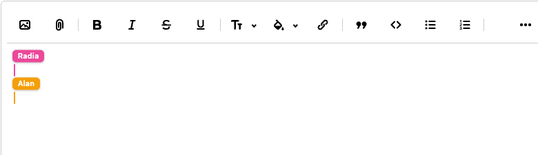

# yrby

[](https://github.com/jpcamara/yrby/actions/workflows/ci.yml)

yrby (pronounced "yer-bee") makes Rails a Yjs backend. It binds
[y-crdt](https://github.com/y-crdt/y-crdt), the Rust engine behind Y.js, into
Ruby, and builds the rest of the stack on top of it: a sync server for Action
Cable and AnyCable, a browser provider, and server-side reading and rendering
of the documents. You get real-time collaboration in a Rails app with no Node
process to run.



On the server, `yrby-rails` implements the y-websocket protocol (document sync
plus presence) as a channel concern. Its delivery contract is stricter than
most Yjs servers: every update is ack-tracked and durably recorded before it is
acknowledged or broadcast to anyone. Replaying your store rebuilds the
document, across any number of processes.
([Delivery guarantees](#delivery-guarantees))

In the browser, `yrby-client`'s `ActionCableProvider` connects anything that
speaks Yjs. The demo app runs four rich text editors, and CI drives each one
in real Chrome: Tiptap, [Lexxy](https://www.npmjs.com/package/lexxy-realtime),
Rhino Editor, and CodeMirror. The same channel also syncs Yjs shapes with no
editor at all: a whiteboard on a `Y.Map`, a kanban board on a `Y.Array`, a
form filled in together. ([Editors](#editors))

In Ruby, the documents are readable and writable without a browser.
`Doc#read_text`, `Doc#read_map`, and `Doc#read_array` rebuild the contents for
search, validation, and exports. `Doc#get_map`, `Doc#get_array`, and
`Doc#get_text` return live handles for building or editing shared state on the
server, and those edits sync to everyone. `Y::Tiptap` and `Y::Lexxy` render a
document to the same HTML the editor's own serializer produces, byte for byte.
They take rules for your app's custom nodes, and their output drops straight
into ActionText. ([Rendering to HTML](#rendering-to-html))

Underneath, the core is built for a production Rails deployment. A `Doc` is
thread-safe across Puma and ActionCable threads. Native CRDT work runs with
the GVL released, so it runs in parallel on MRI. Incoming frames are validated
before anything processes them, and multi-process and AnyCable setups are
tested end to end. ([Thread Safety](#thread-safety))

The integration is one view helper, rendered where the page is already allowed
to edit the record:

```erb
<%= collaborative_document_tag @post, :body %>
```

The tag renders a signed grant for that record and attribute, the same way
`turbo_stream_from` signs its stream names. The gem's `Y::DocumentChannel`
verifies the grant when a client subscribes and records every change as
`Y::Document` rows before it acknowledges the change. The client presents the
grant and attribute name, and you don't write a channel.

The tag renders an element that connects on its own. Import it once, and when
the document has synced your code gets it and hands it to whichever editor
binding you use:

```js
import "yrby-client/element"

document.addEventListener("yrby:synced", ({ target, detail }) => {
  const editor = bindYourEditor(target, detail.doc, detail.provider)
  detail.signal.addEventListener("abort", () => editor.destroy(), { once: true })
})
```

Sessions retain pending edits after an editor leaves the page. Bindings clean up
through the abort signal; clean sessions reload from Rails on a later visit.
See the [client lifecycle and recovery contract](packages/client/README.md#document-sessions).

The document is rows in your database, and you can read it back in Ruby:

```ruby
doc = post.collaborative_document(:body).doc
doc.read_text("content")  # or Y::Lexxy.new(doc).to_html for rich text
```

Install the gem and the npm package:

```
gem install yrby-rails # depends on yrby
npm install yrby-client yjs y-protocols @rails/actioncable

bin/rails generate yrby:install && bin/rails db:migrate
```

## Contents

- [Scope](#scope)
- [Durability and delivery](#durability-and-delivery)
- [What about yrb?](#what-about-yrb)
- [Testing](#testing)
- [Install](#install)
- [Docs](#docs)
- [Editors](#editors)
- [Usage](#usage)
  - [Doc (Low-Level Document Sync)](#doc-low-level-document-sync)
  - [Reading document contents](#reading-document-contents)
  - [Y::Map (live shared maps)](#ymap-live-shared-maps)
  - [Y::Array (live shared lists)](#yarray-live-shared-lists)
  - [Y::Text (live shared text)](#ytext-live-shared-text)
  - [Pending structs and gap-free state](#pending-structs-and-gap-free-state)
  - [Rendering to HTML](#rendering-to-html)
  - [Protocol codec (module functions)](#protocol-codec-module-functions)
  - [ActionCable Integration](#actioncable-integration)
- [Thread Safety](#thread-safety)
  - [Parallelism (GVL release)](#parallelism-gvl-release)
- [Message Type Constants](#message-type-constants)
- [Sync Flow](#sync-flow)
- [Development](#development)
- [License](#license)
- [Acknowledgments](#acknowledgments)

## Scope

`yrby` binds the part of `y-crdt` you need to sync and persist collaborative
documents: a `Doc`, awareness, and the y-websocket protocol primitives. By
default the Ruby side treats a document as opaque CRDT state. It applies
updates, answers sync handshakes, and records deltas without looking at the
contents. The browser editor decides what shape the document has. When you do
need to look inside, `Doc#read_text` and `Doc#read_map` rebuild it in Ruby, and
`Doc#get_map` returns a live handle when the server needs to build or edit
shared state itself.

## Durability and delivery

The API is small. Most of the work went into durability, resiliency, delivery
guarantees, correctness, and thread safety.

To get there, `yrby` adds two opinionated defaults on top of normal Yjs
syncing:

- Update acknowledgement is built in. The `ActionCableProvider` in
  `yrby-client` keeps sending an update until the server acks it, and
  [`yrby-rails`](https://rubygems.org/gems/yrby-rails) only acks once the
  update is durably recorded. That gives you at-least-once delivery. CRDT
  updates are idempotent, so a duplicate is a no-op.
- Gaps are expected. An update can arrive before another update it depends on
  (a "causal gap"). `yrby` records and acks it like any other, and the document
  heals on its own once the missing update arrives, because its sender keeps
  retransmitting it until it is acked. `Doc#pending?` and the `on_gap` hook
  tell you when a document is waiting on a missing update.
  ([Causal gaps](#causal-gaps))

## What about [yrb](https://github.com/y-crdt/yrb)?

`yrb` has a much larger interface. It gives you most of the Yjs type system
(shared text, arrays, maps, XML) to build and query documents in Ruby. It was a
big inspiration for using Yjs from Ruby and Rails, and I considered building on
top of it. A few reasons I went with `yrby` instead:

- `yrb` is largely unmaintained. It was built as an experiment for GitLab, and
  the original author has mostly moved on to other projects.
- [It isn't thread-safe](https://github.com/y-crdt/yrb/issues/72). It segfaults
  in a threaded environment, such as ActionCable.
- It's a much larger set of features to maintain, and most people don't need
  them. The vast majority of Y.js documents are manipulated in the browser, not
  from a server-side language.

## Testing

Ruby and Rust unit tests cover the core. CI also runs the npm client tests and a
Rails demo smoke slice against the real ActionCable stack. The demo includes
heavier local suites for hostile input, crash recovery, multi-browser editing,
AnyCable, and load testing. The benchmark number below is from a single laptop.
Issues and PRs are welcome.

## Install

```ruby
# Core CRDT + protocol primitives:
gem "yrby"

# For the Rails side (the sync channel, document models, the generator).
# Formerly yrby-actioncable; that name stops at 0.3.1.
gem "yrby-rails"
```

Ruby 3.4 or newer. Releases include precompiled gems for Ruby 3.4 and 4.0 on
the supported Ruby platforms, and the release workflow smoke-tests the native
builds on Linux x86_64 and macOS arm64. If a precompiled gem matches your
platform you don't need Rust. A source build needs [Rust](https://rustup.rs).

To work on the gem itself:

```bash
git clone https://github.com/jpcamara/yrby
cd yrby
bundle install
bundle exec rake compile test
```

The rest of the dev setup, plus the demo, is in [CONTRIBUTING.md](CONTRIBUTING.md).

## Docs

- The ActionCable concern and a quickstart are [below](#actioncable-integration).
- [`examples/actioncable-demo`](examples/actioncable-demo): a runnable Rails +
  Tiptap app with collaborative cursors, the AnyCable setup, a Postgres store,
  and the test and load suites.
- [CHANGELOG.md](CHANGELOG.md) and [CONTRIBUTING.md](CONTRIBUTING.md).

## Editors

yrby syncs opaque Yjs updates, so any editor with a Yjs binding works. The demo
app runs four of them, and CI drives each one in real Chrome. It checks
concurrent typing with every keystroke accounted for, remote cursors,
local-only undo, and that the server-side renderers match the editor's own
serializer byte for byte. Each page is a working integration you can copy
from:

| Editor | Yjs binding | Demo code |
|---|---|---|
| [Tiptap](https://tiptap.dev) (v2) | `@tiptap/extension-collaboration` | [`app.js`](examples/actioncable-demo/frontend/src/app.js) |
| [Lexxy](https://github.com/basecamp/lexxy) (Lexical) | [`lexxy-realtime`](https://www.npmjs.com/package/lexxy-realtime) | [`lexxy.js`](examples/actioncable-demo/frontend/src/lexxy.js) |
| [Rhino Editor](https://github.com/KonnorRogers/rhino-editor) (Tiptap 3) | `@tiptap/extension-collaboration` + `-caret` | [`rhino.js`](examples/actioncable-demo/frontend/src/rhino.js) |
| [CodeMirror 6](https://codemirror.net) | `y-codemirror.next` | [`codemirror.js`](examples/actioncable-demo/frontend/src/codemirror.js) |

The demo also syncs plain Yjs shapes with no editor (a whiteboard on a
`Y.Map`, a kanban board on a `Y.Array`, a form filled in together) over the
same channel. The demo README's "Using this in your own app" section has the
integration recipe, and its `NoteMaterializer` shows how to render a document
to ActionText on the server with `Y::Tiptap` or `Y::Lexxy`.

## Usage

### Doc (Low-Level Document Sync)

```ruby
require "y"

# Create docs
doc = Y::Doc.new        # random client ID
doc = Y::Doc.new(12345) # specific client ID (used for CRDT identity)

# Encoding
doc.encode_state_vector           # => current state vector
doc.encode_state_as_update        # => full update (lossless: keeps pending)
doc.encode_state_as_update(sv)    # => update diff against state vector
doc.compacted_state_update        # => full update, gap-free (excludes pending)

# Applying updates
doc.apply_update(update_bytes)    # apply raw V1 update
doc.pending?                      # => true if holding un-integrable pending structs
doc.update_ready?(update)         # => true if update would integrate cleanly (no gap)
doc.update_advances?(update)      # => true if update moves integrated state forward

# Sync protocol
doc.sync_step1                    # => SyncStep1 message (this doc's state vector)
doc.handle_sync_message(data)     # => [msg_type, sync_type, response]; answers a
                                  #    peer's SyncStep1 with full state (lossless,
                                  #    pending included, like Y.js)
```

### Reading document contents

Rebuild a document on the server (for search, exports, emails, SSR) with no
Node process:

```ruby
doc.read_text("prosemirror")  # => plain text of a Y.Text root, or nil
doc.read_xml("root")          # => text of an XML root, one block per line
doc.read_map("state")         # => a Y.Map root as a JSON string; JSON.parse it
doc.read_array("cards")       # => a Y.Array root as a JSON string; JSON.parse it
```

These are read-only snapshots. To *build or edit* a map from Ruby, use a live
handle (below).

### Y::Map (live shared maps)

`Doc#get_map` returns a live handle to a `Y.Map` root: reading it reflects the
current document, and writing it mutates the CRDT (so the change syncs to every
peer). Handles carry the same thread-safety guarantees as `Doc`: every operation
runs with the GVL released and holds no lock across the boundary.

```ruby
map = doc.get_map("state")   # root map, created if absent

# Write: primitives, arrays, and (nested) hashes
map["title"]  = "Dashboard"
map["count"]  = 3
map["tags"]   = %w[a b c]
map["user"]   = { "name" => "Ada", "role" => "eng" }  # nested Y.Map

# Read: a snapshot value (nested map/array come back as Hash/Array)
map["title"]           # => "Dashboard"
map.to_h               # => { "title" => "Dashboard", "count" => 3, ... }
map.keys               # => ["title", "count", "tags", "user"]
map.size               # => 4
map.key?("title")      # => true
map.each { |k, v| puts "#{k}: #{v}" }

# A live handle to a nested map; mutating it mutates the document
user = map.get_map("user")   # => Y::Map (or nil if absent / not a map)
user["name"] = "Grace"       # doc now has state.user.name == "Grace"

# Delete
map.delete("count")    # => 3 (the previous value)
map.clear
```

A handle is addressed by its root name plus a path and re-resolves on every
operation, so it never caches a raw CRDT pointer that could dangle when the tree
is mutated (possibly on another thread). A nested handle keeps working even as
sibling keys change around it.

### Y::Array (live shared lists)

`Doc#get_array` returns a live handle to a `Y.Array` root. The method that
matters is `get_map`: a list of records is the shape most collaborative state
has, and a handle addressed by index is what lets you edit one in place.

```ruby
plan = doc.get_array("plan")   # root array, created if absent

plan.push({ "text" => "Find the posts", "status" => "pending" })
plan << { "text" => "Draft an outline", "status" => "pending" }
plan.insert(1, { "text" => "Summarize them", "status" => "pending" })

plan[0]                        # => { "text" => "Find the posts", ... } (a snapshot)
plan.size                      # => 3
plan.to_a                      # => the whole list, as plain Ruby
plan.each { |step| puts step["text"] }

# A live handle to a record stored in the list. Writing it writes the document.
step = plan.get_map(0)         # => Y::Map (or nil if that element is not a map)
step["status"] = "done"        # every peer sees the status change

plan.delete_at(-1)             # => the removed value
plan.clear
```

Negative indexes count from the end, and an index outside the array reads as
`nil` rather than raising, so a stale index from a concurrent edit is harmless.

### Y::Text (live shared text)

`Doc#get_text` returns a live handle to a `Y.Text` root. Appending is a CRDT
insert rather than a whole-document write, so a person typing in the same text
while a server-side writer appends keeps their edit, and so does the writer.

```ruby
body = doc.get_text("body")

body.push("The agent wrote ")   # append; the hot path when streaming
body << "this sentence."
body.insert(0, "Note: ")        # insert at an index
body.delete(0, 6)               # remove a range

body.to_s                       # => "The agent wrote this sentence."
body.length
body.empty?
body.clear
```

Every handle can reach any nested shared type: `get_map`, `get_array`, and
`get_text` exist on both `Y::Map` and `Y::Array`, so a text field inside a
record inside a list is directly addressable.

> **Naming note.** `Y::Array` and `Y::Text` shadow `::Array` and Ruby's own
> names inside `module Y`. Code in that namespace that means the core class must
> say `::Array` (and `Kernel.Array(...)` for the conversion method), the same way
> channels in `module Y` must say `::ActionCable`. This bit the HTML renderers
> when these classes were added.

### Pending structs and gap-free state

If a doc applies an update whose causally-prior update is missing (a "gappy"
update), yrs parks it as a **pending** struct. The integrated state vector
stays where it was, and the pending block is held as a recovery buffer that
heals if the missing dependency arrives later. `Doc#pending?` reports this.

Pending structs travel like any other state. `handle_sync_message` answers
`SyncStep1` with the doc's full state, pending included, the same way Y.js's
`encodeStateAsUpdate` does. A peer parks the pending struct the way this doc
did and heals it the same way. The one place pending must not go is a
compacted snapshot:

- `Doc#compacted_state_update` returns a gap-free full-state update for
  compaction. Folding a log into one blob would otherwise freeze an
  un-integrable struct into the base state for good. It's non-destructive: the
  doc keeps its pending.
- `encode_state_as_update` stays lossless, so persistence and serving keep the
  raw pending bytes and the gap can still heal.

### Rendering to HTML

The renderers turn a collaborative document into HTML on the server. No Node
process and no headless editor are involved. Each renderer is a class for one
specific editor, and it matches that editor's own serializer byte for byte.
`Y::Tiptap` renders ProseMirror documents and is built on `Y::ProseMirror`.
`Y::Lexxy` renders documents from the [Lexxy](https://github.com/basecamp/lexxy)
editor and is built on `Y::Lexical`. Those base classes are the extension
point: another editor on the same engine extends one of them with rules. Each
renderer returns `nil` for a root that belongs to the other schema.

#### `Y::Tiptap` (and `Y::ProseMirror`, its base)

```ruby
tiptap = Y::Tiptap.new(doc)
tiptap.to_html            # the "default" fragment (Tiptap's default root)
tiptap.to_html("content") # or another XML root
```

The output matches Tiptap's own `getHTML()`. The tests check that byte for byte
against a document captured from a real editor. The implementation follows
[`tiptap-php`](https://github.com/ueberdosis/tiptap-php), and it reads both
naming styles editors use: Tiptap's `bulletList` and `bold`, and
prosemirror-schema-basic's `bullet_list` and `strong`.

It covers paragraphs, headings, blockquotes, bullet, ordered, and task lists,
code blocks, links, images, mentions, details, hard breaks, horizontal rules,
tables, text styles (color and font family), and every text mark. A table
renders as a plain `<table><tbody>`. The column-width styling Tiptap's editor
view adds is left out.

The support comes in two layers, like the Lexical side. `Y::ProseMirror`
handles core ProseMirror natively: prosemirror-schema-basic plus the
prosemirror-tables family. Tiptap's extension nodes (task lists, mentions, the
details family) are a rule set, `Y::Tiptap::NODES`, written on the extension
API described below. Marks live in the base class. Mark rendering covers
nesting order, the CSS on `textStyle`, and the exclusivity of `code`, and it
runs through the native text-run code that node rules can't reach. So
`Y::ProseMirror` renders Tiptap's mark set as is, and `rules.mark` overrides
individual marks.

#### `Y::Lexxy` (and `Y::Lexical`, its base)

```ruby
lexxy = Y::Lexxy.new(doc)
lexxy.to_html            # the "root" fragment (Lexical's default root name)
lexxy.to_html("notepad") # or another XML root
```

The HTML is identical to what a `lexxy-editor` submits to Rails as its `value`.
The tests check that byte for byte against a document captured from a real
editor. Stock Lexical has no canonical serializer, because every editor
configures its own. That's why the class is named after the editor.
`Y::Lexical` is the core Lexical base (paragraphs, headings, quotes, code,
lists, tables, links, and the full text-format model), and any other Lexical
editor extends it with rules.

It handles every node in the Lexxy 0.9.x set: paragraphs, headings, every text
format and their combinations, links, the four list types with nesting,
blockquotes, code blocks, tabs and soft breaks, horizontal rules, tables with
header cells, image galleries, and ActionText attachments. Uploads and mentions
both come out as `<action-text-attachment>` elements, which ActionText can
re-render.

Internally the support is layered the same way. `Y::Lexical` covers core
Lexical structure natively. Everything Lexxy adds, its own node types
(attachments, galleries) and its decorations of core nodes (the table wrapper,
header-cell styling, nested-list classes), is `Y::Lexxy`'s rule set,
`Y::Lexxy::NODES`, written on the extension API below. The gem's own Lexxy
support is the first consumer of that API, so an app rule for one of those
types simply replaces it.

In both renderers an unknown node keeps its content. Its text and nested blocks
still come out as readable markup.

#### Custom nodes and marks

The built-in schemas match what Tiptap and Lexxy ship. Apps add their own node
types on top of that, and both renderers take rules for them. A rule is checked
before the built-in schema, so a rule can add a node type or change how a
built-in one renders.

Rules register in a block, one `rules.node` call per type. A declarative rule
describes the markup as a tag, attributes, and a content mode, and the renderer
emits it natively:

```ruby
tiptap = Y::Tiptap.new(doc) do |rules|
  rules.node "callout", tag: "aside",
                        attrs: { "class" => ["callout callout--", :kind] },
                        contains: :blocks
end
```

`tag` names the element. The values in `attrs` are templates. A string is a
literal. A symbol reads that attribute off the node. An array concatenates a mix
of the two. An attribute that resolves to an empty value is left out. `text`
takes the same template form and emits literal text content. `contains` says
what lives inside the node: `:inline` for formatted text, `:blocks` for child
block nodes, or `:none` for a leaf. `:inline` is the default. `void: true` skips
the closing tag.

You don't have to guess any of those names or shapes. Editors store types and
attributes under names you wouldn't predict. Rhino's strike mark is
`rhino-strike`, and Lexical prefixes its own props with `__`. A real document
will tell you. Make one in your editor that uses your custom node, then:

```ruby
Y::Tiptap.new(doc).node_types
# => { "callout"   => { "count" => 2, "attrs" => ["kind"],
#                       "children" => ["paragraph"], "text" => false,
#                       "handled" => nil },
#      "paragraph" => { ..., "handled" => "builtin" } }
```

A `handled` of nil marks a type that still needs a rule. `attrs` lists the
stored attribute names your templates and blocks will read. `children` and
`text` tell you which `contains:` to pick: child block types mean `:blocks`, and
text means `:inline`.

When a declarative rule can't express the markup, give the node a block:

```ruby
lexical = Y::Lexical.new(doc) do |rules|
  rules.node "video_embed" do |node|
    src = ERB::Util.html_escape(node.attrs["__src"])
    %(<video controls src="#{src}"></video>)
  end
end
```

The block gets the node's type and its stored attributes. `node.content` is the
node's children, already rendered to HTML. `node.child_types` lists the node's
element and block children by type, in document order. That answers the
structural questions attributes don't: how many images a gallery holds, or
whether a list item has a nested list. Whatever the block returns is spliced
into the output as is. It's treated as trusted HTML, so escape any values you
interpolate. To set the content mode for a block, pass both:
`rules.node "embed", contains: :blocks do |node| ... end`.

Blocks never run while the document is locked. The render finishes first, inside
one read transaction with the GVL released. Then the blocks run and their output
is spliced in. That's why a block can safely read the same doc or even write to
it. If no rule has a block, `to_html` skips the splicing step.

Blocks cover everything the declarative form can't. `Y::Lexxy` and `Y::Tiptap`
are built on this same API (`lib/y/lexxy.rb`, `lib/y/tiptap.rb`), so it has
already been used for two complete editor schemas. Their simple nodes are
declarative hashes. Every node with logic is a plain method mapped by node type
(a `Method` responds to `call` like any lambda), and the fixture tests hold that
output byte-identical to a live editor's.

The ProseMirror side also takes custom marks:

```ruby
tiptap = Y::Tiptap.new(doc) do |rules|
  rules.mark "comment", tag: "span", attrs: { "data-comment-id" => :id }
end
```

Symbols resolve against the mark's own attributes. A custom mark wraps outside
every built-in mark. When several custom marks land on one run, they nest
alphabetically by name. A rule for a built-in mark name like `"bold"` replaces
that mark's tag.

##### Worked examples

A video-embed node from an app's Tiptap extension, a type the built-in schema
has never seen:

```ruby
tiptap = Y::Tiptap.new(doc) do |rules|
  rules.node "videoEmbed" do |node|
    src   = ERB::Util.html_escape(node.attrs["src"])
    title = ERB::Util.html_escape(node.attrs["title"] || "Video")
    %(<figure class="video"><iframe src="#{src}" title="#{title}" allowfullscreen></iframe></figure>)
  end
end
```

Resolving mentions against the database. Blocks run after the document read has
finished, so it's safe to hit ActiveRecord (or the doc itself) inside one:

```ruby
tiptap = Y::Tiptap.new(doc) do |rules|
  rules.node "mention" do |node|
    user = User.find_by(id: node.attrs["id"])
    next "<span>@unknown</span>" unless user

    %(<a class="mention" href="/users/#{user.id}">@#{ERB::Util.html_escape(user.handle)}</a>)
  end
end
```

Overriding a shipped rule. This renders Lexxy uploads as real image markup; the
shipped rule emits the `<action-text-attachment>` elements that ActionText
re-renders:

```ruby
lexxy = Y::Lexxy.new(doc) do |rules|
  rules.node "action_text_attachment" do |node|
    src     = ERB::Util.html_escape(node.attrs["src"])
    alt     = ERB::Util.html_escape(node.attrs["altText"].to_s)
    caption = node.attrs["caption"].to_s
    html = %()
    html += "<figcaption>#{ERB::Util.html_escape(caption)}</figcaption>" unless caption.empty?
    "<figure>#{html}</figure>"
  end
end
```

Markup that depends on structure. `node.child_types` lists the node's element
and block children in document order, so a layout container can size itself by
its column count while the columns themselves stay declarative:

```ruby
tiptap = Y::Tiptap.new(doc) do |rules|
  rules.node "columns", contains: :blocks do |node|
    %(<div class="columns columns--#{node.child_types.length}">#{node.content}</div>)
  end
  rules.node "column", tag: "div", attrs: { "class" => "column" }, contains: :blocks
end
```

Content-aware overrides. This drops the empty paragraphs an editor keeps around
the cursor. It works because `node.content` arrives already rendered:

```ruby
lexical = Y::Lexical.new(doc) do |rules|
  rules.node "paragraph" do |node|
    node.content.empty? ? "" : "<p>#{node.content}</p>"
  end
end
```

For a larger reference, the gem's own editor schemas ship this way. See
`Y::Lexxy::NODES` in `lib/y/lexxy.rb` (declarative hashes for the simple nodes,
and a plain method mapped with `method(:name)` for each node that needs logic:
galleries, list items, header cells, both attachment types) and
`Y::Tiptap::NODES` in `lib/y/tiptap.rb` (task lists, mentions, the details
family).

### Protocol codec (module functions)

Classifying and unwrapping wire frames is stateless, so these are module
functions on `Y`, with no object to construct. The server never holds presence
or document state to route a frame. Presence lives in the browser clients, and
the server only relays awareness frames, without reading them.

```ruby
Y.message_kind(frame)         # => 0 drop / 1 step1 / 2 update / 3 awareness / 4 query
Y.update_from_message(frame)  # => the document delta carried by a frame, or nil
Y.wrap_update(update_bytes)   # => wrap a raw doc update as a sync Update frame
```

### ActionCable Integration

In a Rails app, one generator creates the storage migration. The models and
`Y::DocumentChannel` are already in the gem:

```bash
bin/rails generate yrby:install
bin/rails db:migrate
```

The models ship in the gem, the same way Action Text owns
`ActionText::RichText`:

- **`Y::Document`** is one row per document. A row is addressed two ways. The
  first is by `key`, which is what a channel uses: one opaque, unique string,
  sometimes supplied by the app, never parsed. The second is optional: a
  polymorphic `record` plus a `name`, which say which model attribute the
  document backs (`name` is the attribute name, like `"body"`, with one
  document per attribute per record, the ActionText::RichText scheme).
  Key-only documents leave that binding nil. Either side can arrive first.
  `Y::Document.for(record, name)` finds or creates the binding, derives a
  readable key (`post/1/body`), and adopts a key-only row that already holds
  that key. So a channel that writes first and a binding created later end up
  on the same document. The row also holds the merged `state` snapshot, and
  that is CRDT state only. Derived data like rendered HTML or search text is
  the application's job, usually done in the channel's `on_change`.
  `.load_state(key)` and `.append(key, update)` are the store calls the channel
  concern uses by default.
- **`Y::DocumentUpdate`** is the uncompacted tail, one delta per row. Once the
  tail reaches `compact_every` (default 64) it is compacted into `state` and
  deleted. Loading reads the snapshot plus the current tail, and an empty tail
  returns `state` directly. Compaction serializes on a per-document row lock
  and skips rows with an open causal gap. Those are held back until they heal
  instead of being compacted into state or deleted. Destroying a document
  deletes its updates with it.

Encrypted storage: `Y::EncryptedDocument` stores `state` and update payloads
through Active Record encryption, on the same tables, the way
`ActionText::EncryptedRichText` does. Declare it on the model. Encryption is a
property of how the attribute is stored, and a page or client never gets to
choose it:

```ruby
class Post < ApplicationRecord
  has_collaborative_document :body, encrypted: true
end
```

`Y::DocumentChannel` reads that declaration and routes every load and append
for the attribute through the encrypted class. Attributes without the
declaration keep using plain `Y::Document`. In a channel of your own, point
`on_load` and `on_change` at `Y::EncryptedDocument` instead. Either way,
configure your app's encryption keys and use one access path per document.
Rows written encrypted read back as ciphertext through the plain classes.

`post.collaborative_document(:body)` returns a bound `Y::Collaborative::Attribute`
with `load_state`, `append(update)`, `key`, and `doc`. `doc` reconstructs a fresh
native `Y::Doc` for Ruby reads and rendering. For built-in row operations such
as compaction, use `post.collaborative_document(:body).document.compact!`.
The same accessor serves the channel and application code, including encryption.

### Editing a document from Ruby

`edit` makes a Ruby process a peer of the browsers. It loads the current state,
yields a live document, records what the block changed through the declared
storage, and broadcasts it, so every open editor applies it:

```ruby
post.collaborative_document(:body).edit do |doc|
  doc.get_text("content").push("Reviewed by ops.\n")
end
```

The block gets the live handles from `Doc#get_text`, `Doc#get_map`, and
`Doc#get_array`. A block that changes nothing records and broadcasts nothing.
Behind it is `Y::ActionCable.broadcast(key, update)`, which any channel built
on the concern can use after recording an update of its own.

That is enough to put an agent in a document as a collaborator. The one rule
that makes it work: read the document from storage right before acting, never
from a copy taken earlier. Every browser edit is recorded before it is
acknowledged, so the store is the shared truth, and an edit a person makes
while the agent is busy is what the agent acts on next. `examples/agent` is a
runner that does this for a plan written one step per line, with a real-Chrome
test where a person edits step two while step one is running.

Custom storage can use the shipped channel too. Declare one adapter implementing
both `load(record, name)` and `write(record, name, update)`:

```ruby
class PostStore
  def self.load(record, name)
    # Return lossless binary Yjs state, or nil for a new document.
  end

  def self.write(record, name, update)
    # Persist durably before returning. Tolerate duplicates; raise on failure.
  end
end

class Post < ApplicationRecord
  has_collaborative_document :body, storage: PostStore
end
```

The helper and Ruby accessor stay the same. The adapter supplies both channel
loads/appends and `post.collaborative_document(:body).doc`; yrby creates no
built-in document rows for it. A failed write is neither acknowledged nor
broadcast. Custom storage owns encryption and compaction, so combining `storage:`
with `encrypted: true` raises, as does asking a custom attribute for `.document`.
Plain undeclared attributes still use `Y::Document`. Declarations are inherited
without mutating their parent. Changing an existing attribute's storage requires
migrating its data; the declaration does not copy it.

Built-in attributes retain their stored document key. Custom attributes use the
same conventional record/attribute key returned by `Y::Document.key_for(record,
name)`, without requiring a built-in row. Grants keep their existing scope and
lifetime.

To require current user permissions in addition to the signed grant, configure
the shipped channel. The block runs in channel context, so it can use identifiers
such as `current_user` provided by your authenticated Action Cable connection:

```ruby
# config/initializers/yrby.rb
Rails.application.config.to_prepare do
  Y::DocumentChannel.authorize_document do |record, name|
    current_user.present? && record.editable_by?(current_user, attribute: name)
  end
end
```

`editable_by?` is your application's policy method, not a yrby API. The block
receives a freshly located record and the attribute name as a string. A false or
nil result denies access, and the subscription is rejected without opening a
stream or serving any state. An invalid grant is rejected before the block is
called. Without a block, a valid grant is enough, so the view that renders the
helper must still require edit permission. Policy errors fail closed and
propagate to your error handling.

The policy runs once, when the client subscribes. From then on the subscription
is the grant. This is how Action Cable is meant to work, and it keeps a record
load and your own queries off every keystroke and cursor move. The tradeoff is
that a permission revoked mid-session takes effect the next time that client
subscribes. Two things limit that window. Grant expiry is checked on every new
subscription, so a short `expires_in:` on the tag bounds it, provided you also
give the element a `refresh:` URL (see below). And if your application has to
cut off access immediately, stop the subscription yourself when the permission
changes.

The decision is kept for the life of the subscription on both transports. Action
Cable keeps the channel instance. AnyCable builds a fresh one per command, so the
authorized document is declared as channel state and travels with the RPC. That
state is held by anycable-go, not the browser, so a client cannot forge it. A
frame that arrives without an authorized subscription is refused even if its
grant is valid.

Every channel authorizes in one place: `authorized?`, which the concern calls
when a client subscribes, before it opens a stream or serves any state. In a
channel you write, you define it, and it receives the document key. The shipped
`Y::DocumentChannel` defines it for you. Its version runs the
`authorize_document` block with the record and the attribute name, and with no
block a valid grant is enough. A subclass can override `authorized?` directly
instead; the located record is available as `record`.

### Writing rich text from Ruby

Rich-text editors built on Yjs keep their document in `XmlText` nodes.
`Doc#get_xml_text` returns a live `Y::XmlText` handle with the operations that
shape needs: `insert` a string, `insert_embed` a JSON value, `set_attribute`,
and `push_xml_text(attributes)` to append a nested block and get its handle.
Blocks are addressed by ordinal, so a handle stays valid after other edits.

`Y::Lexical` builds Lexical's exact node shape on top of that, so what Ruby
appends renders the same as what a person typed and an open editor applies it
as an ordinary remote edit:

```ruby
doc = Y::Doc.new
Y::Lexical.append_heading(doc, "Agent review", tag: "h2")
Y::Lexical.append_paragraph(doc, "Read 82 words. One suggestion: name who signs off.")
Y::Lexxy.new(doc).to_html("root")
# => "<h2>Agent review</h2><p>Read 82 words. One suggestion: name who signs off.</p>"
```

To put that into a shared document, do it inside `edit` (or diff against a
state vector, record the update, and broadcast it). The renderer is the
check: a Ruby-written paragraph and a typed one render byte for byte the same.

A caret is a Yjs relative position, and `relative_position(index)` builds
one: the `{type, tname, item, assoc}` hash editors put in awareness as
`anchorPos` and `focusPos`. Ids are global, so a position built from a
replayed document resolves in every open editor. Put it in the presence
state and the agent has a caret people can see move.

### Presence from Ruby

`Y::Awareness` lets a Ruby process show up as a live collaborator, the way a
browser does. Set a state and broadcast the frame it returns:

```ruby
presence = Y::Awareness.new
frame = presence.set_local_state({ name: "Agent", color: "#7c3aed" }.to_json)
# Relay `frame` to the document's subscribers:
#   Y::ActionCable.broadcast_awareness(document_key, frame)
```

`set_local_state` takes a JSON string (the shape your editor renders) and
returns the y-protocol awareness frame; `Y::ActionCable.broadcast_awareness`
relays it as is (document updates go through `broadcast`, which frames them).
Browsers subscribed to the document apply it as another participant. `clear_local_state` returns the frame that
removes the presence. Awareness expires on a timer, so a long-lived process
re-broadcasts its state periodically to stay present. The bytes are the same
wire format Yjs and y-protocols use, so nothing on the client changes.

### Grant lifetime and refresh

A grant lives as long as GlobalID's signed-id default, which is one month under
Rails. `expires_in:` on the tag shortens it. But the grant is baked into the
page, and Action Cable resubscribes with it after every network drop, so a grant
shorter than an editing session would block the editor at the first
reconnect after it expired. Pair it with `refresh:`, a URL the element fetches
when a subscription is rejected:

```erb
<%= collaborative_document_tag @post, :body, expires_in: 10.minutes,
                               refresh: grant_post_path(@post) %>
```

```ruby
# config/routes.rb:  resources :posts do get :grant, on: :member end
# app/controllers/posts_controller.rb
def grant
  @post = current_user.posts.find(params[:id])   # your own authorization, again
  render json: { grant: @post.collaborative_sgid(:body, expires_in: 10.minutes) }
end
```

That action mints write access, so it must be at least as strict as the page
that renders the tag. Without an authorization check it hands grants to anyone
who can reach the URL, and a short `expires_in:` protects nothing.

On a rejection the element fetches that URL with the session cookie, and the
action re-runs your authorization. A `{ "grant": ... }` response resubscribes
the same session, with the same document and pending edits, under the new
grant. Anything else, a non-2xx status or a second rejection, blocks the session
as before. Nothing renews on a timer, so an open, healthy subscription is never
interrupted. Every reconnect after expiry is a fresh permission check, which is
what a short lifetime is for.

For room-keyed collaboration or other custom channel behavior, generate a
channel with `bin/rails generate yrby:install --channel` and implement its
`authorized?(key)`. Both storage hooks remain available in custom channels.

The migration creates `y_documents` and `y_document_updates`. To rename them,
edit the generated migration and point `Y::Document.table_name` and
`Y::DocumentUpdate.table_name` at the new names in an initializer.

Storage is swappable. The channel only needs `on_load` and `on_change`
answered, and they can point at anything.

`include Y::ActionCable` (from the `yrby-rails` gem) is the channel
integration. It implements the y-websocket protocol, document sync plus
awareness and presence, over ActionCable.

```ruby
# app/channels/document_channel.rb
class DocumentChannel < ApplicationCable::Channel
  include Y::ActionCable

  on_load { |key| Y::Document.load_state(key) }          # rebuild from storage
  on_change { |key, update| Y::Document.append(key, update) } # record, then broadcast

  def subscribed
    sync_subscribed params[:id]
  end

  def receive(data)
    sync_receive(data, params[:id])
  end

  private

  # Everyone is denied until you wire this to your app's auth:
  # sync_subscribed rejects the subscription unless it returns true.
  def authorized?(_document_key) = false
end
```

For documents that belong to a record, `Y::Collaborative` (which the engine
includes into Active Record) provides the token flow `authorized?` needs. The
page mints a signed GlobalID scoped to one attribute, and the channel trades it
back for the record. The page decides which document the client gets.

```erb
<%# the view names the document, signed %>
<%= tag.div data: { grant: post.collaborative_sgid(:body) } %>
```

```ruby
# the channel trades the token back for the record. Not memoized: under
# AnyCable each command builds a fresh channel, and a cached record would go
# stale.
def authorized?(_key) = record.present? && record.editable_by?(current_user)
def record = Y::Collaborative.locate(params[:grant], :body)
```

A token minted for `:body` only verifies under `:body`'s purpose
(`"yrby/body"`). Tampered, expired, and wrong-attribute tokens locate nothing.

The concern is backed by your store. A handshake is answered from `on_load`.
Document changes go through `on_change` and are then broadcast. Nothing
authoritative is kept in ActionCable process memory, so AnyCable RPC workers,
Puma workers, and separate dynos can all handle messages for the same document,
as long as they share the same store and the same cable adapter.

`on_load` and `on_change` default together to `Y::Document` storage when the
yrby-rails models are installed and neither hook is declared. To replace
storage, declare both hooks so reads and writes use the same store. A subclass
may override either hook of an explicitly configured pair. Outside a
yrby-rails app there is no default, and the channel fails before it can
acknowledge or broadcast an edit until you declare both. Presence is ephemeral.
Awareness frames are relayed, and `yrby-client` sends a best-effort
presence-removal frame on disconnect and on `pagehide`. When a client can't
send that frame, the client-side awareness timeout removes it instead.

Incoming frames are validated as a single well-formed protocol message before
anything processes or relays them. Malformed, truncated, multi-message,
oversized, and unknown frames are dropped. A bad frame can't crash the process:
a Rust panic is caught at the FFI boundary and re-raised as a Ruby exception.
No single client can relay garbage that breaks the others in a room.

#### Delivery guarantees

The contract is the same at every scale, from one process to hundreds of them
across many servers:

- **The document always converges.** CRDT updates are commutative and
  idempotent. Out-of-order, duplicate, and concurrent delivery all end up at the
  same correct document. This needs no coordination and holds everywhere.
- **An acked update is durable, even one that arrived out of order.** An update
  with a missing dependency is recorded and acked like any other, and it waits
  as pending in the document. The missing dependency is an update some client
  still holds unacked. That client keeps retransmitting it until the server
  records it, and then the gap closes. See [Causal gaps](#causal-gaps).
- **`on_change` runs at least once, and the durable guarantee is that replaying
  the log reconstructs the document.** Every update triggers `on_change` before
  it is acked or broadcast. If you need exactly-once, make `on_change`
  idempotent. The CRDT handles duplicates either way.
- **A raising `on_change` rejects the update implicitly.** If the block raises,
  the update is neither acked nor broadcast. There is no negative ack. The
  client never gets the ack, keeps the update pending, and retransmits on its
  timer or on reconnect. This is built for transient failures, where a retry
  lands (the store was briefly down). A block that raises deterministically (a
  validation that always fails for this edit) will be retried forever, because
  nothing tells the client to stop. Enforce hard rejections before the edit
  reaches `on_change`, in the channel's authorization at subscribe time. Don't
  raise inside the hook for that.
- **An over-cap frame is dropped the same silent way.** A frame larger than
  `max_frame_bytes` (default 8 MiB) is dropped before decoding, with no ack and
  no broadcast. That bounds the work a client can force. For a real document
  update it means the same implicit rejection as above: unacked, retransmitted
  forever. Normal typing never gets near the cap, but a large paste, an
  embedded image, or a big initial `SyncStep2` can. The drop is logged (`warn`
  for over-cap, `debug` for undecodable) with the document key and update id,
  so it's findable. Override `sync_log_context` on the channel to add a user or
  connection id. Size the cap for your largest expected payload, and reject
  content that really is too big upstream. The cap is a backstop, not a
  graceful rejection.

#### Causal gaps

Yjs updates can arrive out of order. An update can reach the server before the
update it depends on. yrby treats that as normal. The update is recorded and
acked like any other, waits as a pending struct in the document, and
integrates on its own the moment the missing dependency lands. The write path
never rebuilds the document. It appends, relays, and acks, so a gapped update
costs the same as any other.

Serving is lossless too, like any Yjs server. `handle_sync_message` serves full
state, pending included, so a peer parks the same pending struct and heals it
the same way. Healing needs no special machinery. The missing dependency is an
update its sender still holds unacked, and at-least-once retransmission
delivers it. Only compaction excludes pending (`compacted_state_update`),
because folding a log must not freeze an un-integrable struct into the base
state.

The bundled `Y::Document` store handles all of this. If you write your own
store, keep two things in mind:

**1. Load losslessly, and tolerate duplicates.** `on_load` should return state
that preserves pending updates: `encode_state_as_update`, or a replay of the
raw append log. Don't compact with `compacted_state_update` while
`doc.pending?` is true. That strips the pending struct, and the acked edit
inside it goes with it. (`Y::Document` holds pending rows back from compaction
for this reason.) A lost ack also means a client resends an update the store
already has. Replay converges anyway, because CRDT apply is idempotent, so
deduping is optional. If log size matters, dedup by content hash:

```ruby
class DocumentStore
  # append tolerates duplicates: a re-delivered update upserts to a no-op.
  def append(key, update)
    Revision.upsert({ doc_key: key, update_hash: Digest::SHA256.hexdigest(update), update: update },
                    unique_by: %i[doc_key update_hash])
  end

  # load is lossless: replay the raw log so a pending struct is preserved and
  # heals when its dependency arrives.
  def load(key)
    updates = Revision.where(doc_key: key).order(:id).pluck(:update)
    return nil if updates.empty?

    doc = Y::Doc.new
    updates.each { |u| doc.apply_update(u) }
    doc.encode_state_as_update # lossless: keeps pending
  end

  # optional compaction: only when there is no open gap, or you would drop it.
  def compact(key)
    doc = Y::Doc.new
    Revision.where(doc_key: key).order(:id).pluck(:update).each { |u| doc.apply_update(u) }
    return if doc.pending? # a gap is open; compacting now would drop it
    # ... replace the log with a single revision holding doc.compacted_state_update ...
  end
end
```

**2. Watch for gaps that never heal.** An open gap doesn't announce itself. The
edit sits as pending, invisible in the document, until its dependency arrives.
Normally that resolves on its own. The sender retransmits the missing update
until it is acked, and every join or reconnect handshake has the client send
everything the server hasn't integrated, so any client holding the dependency
supplies it just by connecting. The gap worth alerting on is one that no live
client can supply, and that is what the `on_gap` hook surfaces. It fires with
the document key whenever a document is loaded to serve state and a gap is
still open. Use it to emit a metric (a pending-document count, or the age of
the oldest open gap) so a stuck gap is visible. Gaps are also logged at `info`.
Errors raised in the hook are swallowed, so a broken metrics call can't break
frame handling.

```ruby
class DocumentChannel < ApplicationCable::Channel
  include Y::ActionCable

  on_gap { |key| StatsD.increment("yrby.gap", tags: ["doc:#{key}"]) }
end
```

#### Multi-process deployments

Most Rails apps run several processes, and any of them might end up serving a
given document. Two things keep them consistent.

Broadcasts cross processes through the Action Cable adapter, so use `redis`,
`solid_cable`, or another adapter that crosses processes. The `async` adapter
only works inside one process. With a real adapter in place, a change on one
process reaches clients on all of them.

Every process rebuilds document state from the durable store through
`on_load`. Changes are recorded before they're broadcast, and that holds across
processes too: whichever process receives a change writes it to the shared
store before any client in any process sees it.

`bun multiprocess.mjs` in the demo runs clients across two processes. It checks
that the documents converge, that fresh reads work on both processes, that
presence crosses processes, and that both processes write to one shared log.

##### AnyCable

`yrby` supports AnyCable end to end.

The demo checks it against a real anycable-go server and RPC server, in
`frontend/anycable_probe.mjs` and `anycable_concurrent.mjs`. Those cover
liveness, the yrby client provider, cross-process reads, and convergence under
concurrent editing.

##### Demo

[`examples/actioncable-demo`](examples/actioncable-demo) is a full Rails + Tiptap
app using the yrby provider, with end-to-end tests.

#### Record Before Distribute

Every document change is handed to the `on_change` handler before it is
broadcast. Recording it durably is your job:

```ruby
class DocumentChannel < ApplicationCable::Channel
  include Y::ActionCable

  # ...

  on_change do |key, update|
    # Synchronous, durable write. `update` is the exact CRDT delta.
    AuditLog.append!(key, update)   # raise to REJECT the change
  end

  # ...
end
```

If the recorder raises (say the store is down), the change is rejected: it
isn't applied and it isn't sent to anyone. The cost is a synchronous durable
write on the path of every change. There is no per-document lock in the gem,
so two concurrent writes to one document can both record (at least once). CRDT
apply is idempotent, so a duplicate record replays to the same document.

The demo wires `on_change` to a durable Postgres-backed log by default, and
checks end to end that the log alone rebuilds the document.

#### Ephemeral documents (no database)

`on_load` and `on_change` are plain blocks, and nothing requires them to touch
a database. Some documents don't need to outlive their session: a scratchpad,
live form state, a draft you only persist on submit. For those, the store can
be connection state that travels with each request:

```ruby
class ScratchpadChannel < ApplicationCable::Channel
  include Y::ActionCable

  on_load { |key| @doc_state }

  on_change do |key, update|
    doc = Y::Doc.new
    doc.apply_update(@doc_state) if @doc_state
    doc.apply_update(update)
    @doc_state = doc.compacted_state_update
  end

  def subscribed    = sync_subscribed(params[:id])
  def receive(data) = sync_receive(data, params[:id])

  private

  # The scratchpad lives on this connection: every subscriber gets their own.
  def authorized?(_key) = true
end
```

On AnyCable the channel object doesn't survive between messages, so an
instance variable won't hold. Declare the store as channel state instead
(`state_attr_accessor` comes from anycable-rails) and Base64 it, because that
state is serialized as JSON into each RPC exchange with `anycable-go`:

```ruby
class ScratchpadChannel < ApplicationCable::Channel
  include Y::ActionCable

  state_attr_accessor :doc_state

  on_load { |key| doc_state && Base64.strict_decode64(doc_state) }

  on_change do |key, update|
    doc = Y::Doc.new
    doc.apply_update(Base64.strict_decode64(doc_state)) if doc_state
    doc.apply_update(update)
    self.doc_state = Base64.strict_encode64(doc.compacted_state_update)
  end

  def subscribed    = sync_subscribed(params[:id])
  def receive(data) = sync_receive(data, params[:id])

  private

  def authorized?(_key) = true # per-connection scratchpad, see above
end
```

Both hooks run in the channel instance through `instance_exec`, so they can use
anything the channel can. `sync_receive` rebuilds the document from `on_load`
on every update, which is what lets the store live on the connection. On Action
Cable the channel instance lasts as long as the connection, so an instance
variable is the whole store. Merging into `compacted_state_update` keeps it one
blob instead of a growing update log.

The store is per connection, and that shapes what this is good for. A single
writer gets the full delivery contract with no database anywhere. With several
people editing at once, one client's update can depend on edits its own
connection has never seen. That update records as pending, and the next
handshake with that client (which always holds the full document) supplies the
missing state and heals it. The document still converges. Heavy concurrent
editing just parks more pending between handshakes than a shared store would.
On AnyCable, keep the payload size in mind too. The blob travels with every
message, so this only makes sense for small documents.

Durability is the connection plus the browsers. A reconnecting client re-seeds
an empty server through the ordinary sync handshake, so the document survives a
server restart as long as some client still has it. For ephemeral documents
shared across clients on a single-process deployment, the same two hooks over a
class-level `Concurrent::Map` work instead. That version stops being coherent
the moment you scale past one process.

#### Reliable delivery (acks)

yrby document delivery is ack-tracked. Browser document updates carry an
`"id"`, and the server replies `{ "ack": <id> }` once `on_change` has fired
successfully. Every decodable document update is recorded and acked, including
one that arrives out of order.

```
client -> server   { "update": "<base64 update>", "id": 42 }
server -> client   { "ack": 42 }     # update accepted; safe to forget
```

`yrby-client`'s `ActionCableProvider` handles this for you. It keeps the
unacknowledged local document tail in a queue and sends the merged tail as one
causally complete delta. The id is the highest sequence in the batch, so one
`{ ack: id }` confirms everything up to it. CRDT apply is idempotent, so a
resend that already landed is a harmless no-op that just gets acked again.
Awareness stays ephemeral and is not acked.

Presence (cursors, selections) is owned by the browser clients. The server
never sets or holds presence state. It only relays awareness frames, without
reading them. See `yrby-client` for the client-side awareness API.

## Thread Safety

A `Doc` can be shared across Ruby threads. Puma workers, ActionCable
connection threads, and background jobs can all use the same one at once, with
no locking on your side.

`test/thread_safety_test.rb` runs shared docs, the full sync handshake, and
fan-in sync across 8 threads at once, and checks that the interleaving doesn't
change convergence.

### Parallelism (GVL release)

Every method that does real CRDT work (applying updates, encoding state,
handling sync messages) releases Ruby's Global VM Lock
(`rb_thread_call_without_gvl`) while the native code runs. That buys two things.

CRDT work runs in parallel across Ruby threads on MRI, and you don't need JRuby
or TruffleRuby for that. `bench/parallelism_bench.rb` measures over 2x
wall-clock speedup applying a roughly 900 KB update concurrently. Native code
that held the GVL couldn't beat serial time.

A slow operation also can't stall the VM. A thread applying a large update
holds the doc's write lock without holding the GVL, so the other Ruby threads
keep running instead of queuing behind it.

Each of those methods follows the same steps. Copy the Ruby byte strings first.
Release the GVL. Do the yrs work, taking and releasing the native locks inside
that closure. Take the GVL back. Then build the Ruby objects. No Ruby API is
touched without the GVL, and no native lock is held while reacquiring it, so
the lock order can't deadlock. A panic in native code is caught and re-raised
as a Ruby exception.

## Message Type Constants

```ruby
Y::MSG_SYNC            # 0 - Document sync messages
Y::MSG_AWARENESS       # 1 - User presence data

Y::MSG_SYNC_STEP1      # 0 - State vector request
Y::MSG_SYNC_STEP2      # 1 - Update response
Y::MSG_SYNC_UPDATE     # 2 - Incremental update
```

## Sync Flow

```
Client A                          Server
   |                                  |
   |-------- connect() ------------->|
   |  (SyncStep1 + Awareness)        |
   |                                  |
   |<--- handle_sync_message resp ---|
   |  (SyncStep2)                    |
   |                                  |
   |  (Document synchronized!)        |
   |                                  |
   |<------- updates ----------------|
   |-------- updates --------------->|
```

## Development

```bash
# Setup
bundle install

# Build extension
rake compile

# Run tests
rake test

# Clean build artifacts
rake clean
```

## License

MIT License

## Acknowledgments

- [y-crdt/yrs](https://github.com/y-crdt/y-crdt) - The Rust implementation of Y.js
- [Magnus](https://github.com/matsadler/magnus) - Ruby bindings for Rust
- [rb-sys](https://github.com/oxidize-rb/rb-sys) - Rust extensions for Ruby
