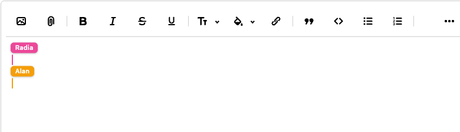

# yrby

[](https://github.com/jpcamara/yrby/actions/workflows/ci.yml)

yrby (pronounced "yer-bee") makes Rails a Yjs backend. It binds
[y-crdt](https://github.com/y-crdt/y-crdt), the Rust engine behind Y.js, into
Ruby, and on top of that it builds a sync server for Action
Cable and AnyCable, a browser provider, and server-side reading and rendering
of the documents. You get real-time collaboration in a Rails app with no Node
process to run.



On the server, `yrby-rails` implements the y-websocket protocol (document sync
and presence) as a channel concern. The server writes every update to your
store before it acknowledges the update or sends it to other clients, which
most Yjs servers don't do. Replaying the store rebuilds the document, however
many processes you run. ([Delivery guarantees](#delivery-guarantees))

In the browser, `yrby-client`'s `ActionCableProvider` connects anything that
speaks Yjs. The demo app runs four rich text editors, and CI drives each one
in real Chrome: Tiptap, [Lexxy](https://www.npmjs.com/package/lexxy-realtime),
Rhino Editor, and CodeMirror. The same channel also syncs Yjs shapes with no
editor at all: a whiteboard on a `Y.Map`, a kanban board on a `Y.Array`, a
form filled in together. ([Editors](#editors))

In Ruby, the documents are readable without a browser. `Doc#read_text` and
`Doc#read_map` rebuild the contents for search, validation, and exports.
`Y::Tiptap` and `Y::Lexxy` render a document to HTML that matches the editor's
own serializer byte for byte. You can add rules for your app's custom nodes,
and you can save the output directly to ActionText.
([Rendering to HTML](#rendering-to-html))

Underneath, the core is built for a production Rails deployment. A `Doc` is
thread-safe across Puma and ActionCable threads. Native CRDT work runs with
the GVL released, so it runs in parallel on MRI. Incoming frames are validated
before anything processes them, and multi-process and AnyCable setups are
tested end to end. ([Thread Safety](#thread-safety))

You add one view helper, on a page where the user can already edit the record:

```erb
<%= collaborative_document_tag @post, :body %>
```

The helper renders a signed grant for that record and attribute, much as
`turbo_stream_from` signs its stream names. The client subscribes with the
grant and the attribute name. The gem's `Y::DocumentChannel` verifies the
grant, then saves every change as `Y::Document` rows before acknowledging it,
so you don't have to write a channel yourself.

The tag renders an element that connects by itself once you import it. When the
document has synced, your listener receives it and passes it to your editor
binding:

```js
import "yrby-client/element"

document.addEventListener("yrby:synced", ({ target, detail }) => {
  const editor = bindYourEditor(target, detail.doc, detail.provider)
  detail.signal.addEventListener("abort", () => editor.destroy(), { once: true })
})
```

If the user leaves the page with edits still unsent, the session keeps them and
finishes delivering. Your binding cleans up when the abort signal fires, and if
nothing is pending, the next visit loads the document from Rails. The [client
lifecycle and recovery contract](packages/client/README.md#document-sessions)
has the details.

The document is stored as rows in your database, and you can read it back in
Ruby:

```ruby
doc = post.collaborative_document(:body).y_doc
doc.read_text("content")  # or Y::Lexxy.new(doc).to_html for rich text
```

Install the gem and the npm package:

```
gem install yrby-rails # depends on yrby
npm install yrby-client yjs y-protocols @rails/actioncable

bin/rails generate yrby:install && bin/rails db:migrate
```

## Contents

- [Scope](#scope)
- [Durability and delivery](#durability-and-delivery)
- [What about yrb?](#what-about-yrb)
- [Testing](#testing)
- [Install](#install)
- [Docs](#docs)
- [Editors](#editors)
- [Usage](#usage)
  - [Doc (Low-Level Document Sync)](#doc-low-level-document-sync)
  - [Reading document contents](#reading-document-contents)
  - [Pending structs and gap-free state](#pending-structs-and-gap-free-state)
  - [Rendering to HTML](#rendering-to-html)
  - [Protocol codec (module functions)](#protocol-codec-module-functions)
  - [ActionCable Integration](#actioncable-integration)
- [Thread Safety](#thread-safety)
  - [Parallelism (GVL release)](#parallelism-gvl-release)
- [Message Type Constants](#message-type-constants)
- [Sync Flow](#sync-flow)
- [Development](#development)
- [License](#license)
- [Acknowledgments](#acknowledgments)

## Scope

`yrby` binds the parts of `y-crdt` you need to sync and persist collaborative
documents, which are a `Doc`, awareness, and the y-websocket protocol
primitives. By default the Ruby side treats a document as opaque CRDT state. It
applies updates, answers sync handshakes, and records deltas without reading
the contents, and the browser editor decides what shape the document has. When
you do need to look inside, `Doc#read_text` and `Doc#read_map` rebuild it in
Ruby.

## Durability and delivery

The API is small, and most of the work went into durability, resiliency, delivery
guarantees, correctness, and thread safety.

`yrby` adds two opinionated defaults on top of normal Yjs syncing:

- yrby acknowledges updates. The `ActionCableProvider` in `yrby-client` keeps
  resending an update until the server acks it, and
  [`yrby-rails`](https://rubygems.org/gems/yrby-rails) only acks an update
  after it's durably recorded. Together that gives you at-least-once delivery,
  and because CRDT updates are idempotent, a duplicate does nothing.
- yrby expects causal gaps, where an update arrives before another update it
  depends on, and it records and acks that update like any other. The sender of
  the missing update keeps retransmitting it until it's acked, and the gap
  closes when it arrives. `Doc#pending?` and the `on_gap` hook
  tell you when a document is waiting on a missing update.
  ([Causal gaps](#causal-gaps))

## What about [yrb](https://github.com/y-crdt/yrb)?

`yrb` has a much larger interface, with most of the Yjs type system (shared
text, arrays, maps, XML) for building and querying documents in Ruby. It was a
big inspiration for me in using Yjs from Ruby and Rails, and I considered
building on top of it. I went with `yrby` for a few reasons:

- `yrb` started as an experiment for GitLab, and its original author has mostly
  moved on to other projects, so it's largely unmaintained.
- [It isn't thread-safe](https://github.com/y-crdt/yrb/issues/72), and it
  segfaults in threaded environments like ActionCable.
- It's a much larger set of features to maintain, and most people don't need
  them. The vast majority of Y.js documents are only ever manipulated in the
  browser.

## Testing

Ruby and Rust unit tests cover the core. CI also runs the npm client tests and a
Rails demo smoke slice against the real ActionCable stack. The demo includes
heavier local suites for hostile input, crash recovery, multi-browser editing,
AnyCable, and load testing. The benchmark number below is from a single laptop.
Issues and PRs are welcome.

## Install

```ruby
# Core CRDT + protocol primitives:
gem "yrby"

# For the Rails side (the sync channel, document models, the generator).
# Formerly yrby-actioncable; that name stops at 0.3.1.
gem "yrby-rails"
```

yrby needs Ruby 3.4 or newer. Releases include precompiled gems for Ruby 3.4
and 4.0 on the supported Ruby platforms, and the release workflow smoke-tests
the native builds on Linux x86_64 and macOS arm64. You only need
[Rust](https://rustup.rs) when no precompiled gem matches your platform and the
gem builds from source.

To work on the gem itself:

```bash
git clone https://github.com/jpcamara/yrby
cd yrby
bundle install
bundle exec rake compile test
```

The rest of the dev setup, plus the demo, is in [CONTRIBUTING.md](CONTRIBUTING.md).

## Docs

- The ActionCable concern and a quickstart are [below](#actioncable-integration).
- [`examples/actioncable-demo`](examples/actioncable-demo): a runnable Rails +
  Tiptap app with collaborative cursors, the AnyCable setup, a Postgres store,
  and the test and load suites.
- [CHANGELOG.md](CHANGELOG.md) and [CONTRIBUTING.md](CONTRIBUTING.md).

## Editors

yrby syncs opaque Yjs updates, so any editor with a Yjs binding works. The demo
app runs four of them, and CI drives each one in real Chrome to check
concurrent typing with every keystroke accounted for, remote cursors,
local-only undo, and that the server-side renderers produce the same HTML as
the editor's own serializer. Each demo page is a working integration you can
copy from:

| Editor | Yjs binding | Demo code |
|---|---|---|
| [Tiptap](https://tiptap.dev) (v2) | `@tiptap/extension-collaboration` | [`app.js`](examples/actioncable-demo/frontend/src/app.js) |
| [Lexxy](https://github.com/basecamp/lexxy) (Lexical) | [`lexxy-realtime`](https://www.npmjs.com/package/lexxy-realtime) | [`lexxy.js`](examples/actioncable-demo/frontend/src/lexxy.js) |
| [Rhino Editor](https://github.com/KonnorRogers/rhino-editor) (Tiptap 3) | `@tiptap/extension-collaboration` + `-caret` | [`rhino.js`](examples/actioncable-demo/frontend/src/rhino.js) |
| [CodeMirror 6](https://codemirror.net) | `y-codemirror.next` | [`codemirror.js`](examples/actioncable-demo/frontend/src/codemirror.js) |

The demo also syncs plain Yjs shapes with no editor (a whiteboard on a
`Y.Map`, a kanban board on a `Y.Array`, a form filled in together) over the
same channel. The demo README's "Using this in your own app" section has the
integration recipe, and its `NoteMaterializer` shows how to render a document
to ActionText on the server with `Y::Tiptap` or `Y::Lexxy`.

## Usage

### Doc (Low-Level Document Sync)

```ruby
require "y"

# Create docs
doc = Y::Doc.new        # random client ID
doc = Y::Doc.new(12345) # specific client ID (used for CRDT identity)

# Encoding
doc.encode_state_vector           # => current state vector
doc.encode_state_as_update        # => full update (lossless: keeps pending)
doc.encode_state_as_update(sv)    # => update diff against state vector
doc.compacted_state_update        # => full update, gap-free (excludes pending)

# Applying updates
doc.apply_update(update_bytes)    # apply raw V1 update
doc.pending?                      # => true if holding un-integrable pending structs
doc.update_ready?(update)         # => true if update would integrate cleanly (no gap)
doc.update_advances?(update)      # => true if update moves integrated state forward

# Sync protocol
doc.sync_step1                    # => SyncStep1 message (this doc's state vector)
doc.handle_sync_message(data)     # => [msg_type, sync_type, response]; answers a
                                  #    peer's SyncStep1 with full state (lossless,
                                  #    pending included, like Y.js)
```

### Reading document contents

Rebuild a document on the server for search, exports, emails, or SSR, with no
Node process:

```ruby
doc.read_text("prosemirror")  # => plain text of a Y.Text root, or nil
doc.read_xml("root")          # => text of an XML root, one block per line
doc.read_map("state")         # => a Y.Map root as a JSON string; JSON.parse it
doc.read_array("cards")       # => a Y.Array root as a JSON string; JSON.parse it
```

### Pending structs and gap-free state

If a doc applies an update whose causally-prior update is missing (a "gappy"
update), yrs holds it as a **pending** struct and the integrated state vector
doesn't move. yrs keeps the pending block as a recovery buffer and integrates
it if the missing dependency arrives later. `Doc#pending?` tells you when a doc
is in this state.

`handle_sync_message` answers `SyncStep1` with the doc's full state, pending
structs included, which is what Y.js's `encodeStateAsUpdate` does too. A peer
that receives it holds the pending struct and integrates it the same way this
doc would. The one place pending structs must be left out is a compacted
snapshot:

- `Doc#compacted_state_update` returns a gap-free full-state update for
  compaction. Folding a log into one blob would otherwise freeze an
  un-integrable struct into the base state permanently. The call doesn't modify
  the doc, which keeps its pending structs.
- `encode_state_as_update` is lossless, so persistence and serving keep the
  raw pending bytes and the gap can still close.

### Rendering to HTML

The renderers turn a collaborative document into HTML on the server with no
Node process or headless editor. Each renderer is a class for one editor, and
its output matches that editor's own serializer. `Y::Tiptap` renders
ProseMirror documents and is built on `Y::ProseMirror`, and `Y::Lexxy` renders
documents from the [Lexxy](https://github.com/basecamp/lexxy) editor and is
built on `Y::Lexical`. To support another editor on one of those engines,
extend the matching base class with rules. Each renderer
returns `nil` for a root that belongs to the other schema.

#### `Y::Tiptap` (and `Y::ProseMirror`, its base)

```ruby
tiptap = Y::Tiptap.new(doc)
tiptap.to_html            # the "default" fragment (Tiptap's default root)
tiptap.to_html("content") # or another XML root
```

The output matches Tiptap's own `getHTML()`, and the tests check it against a
document captured from a real editor. The implementation follows
[`tiptap-php`](https://github.com/ueberdosis/tiptap-php) and accepts both
naming styles editors use, Tiptap's `bulletList` and `bold` as well as
prosemirror-schema-basic's `bullet_list` and `strong`.

It covers paragraphs, headings, blockquotes, bullet, ordered, and task lists,
code blocks, links, images, mentions, details, hard breaks, horizontal rules,
tables, text styles (color and font family), and every text mark. Tables render
as a plain `<table><tbody>` without the column-width styling that Tiptap's
editor view adds.

Support is split into two layers, as on the Lexical side. `Y::ProseMirror`
handles core ProseMirror natively, meaning prosemirror-schema-basic plus the
prosemirror-tables family. Tiptap's extension nodes (task lists, mentions, the
details family) are a rule set, `Y::Tiptap::NODES`, written with the extension
API described below. Marks are handled in the base class. Mark rendering deals
with nesting order, the CSS on `textStyle`, and the exclusivity of `code`, and
it runs through native text-run code that node rules can't reach, so
`Y::ProseMirror` renders Tiptap's mark set as is. You can override individual
marks with `rules.mark`.

#### `Y::Lexxy` (and `Y::Lexical`, its base)

```ruby
lexxy = Y::Lexxy.new(doc)
lexxy.to_html            # the "root" fragment (Lexical's default root name)
lexxy.to_html("notepad") # or another XML root
```

The HTML is identical to the `value` a `lexxy-editor` submits to Rails, and the
tests check it against a document captured from a real editor. The class is
named after the editor because stock Lexical has no canonical serializer, and
every editor configures its own. `Y::Lexical` is the core Lexical base
(paragraphs, headings, quotes, code, lists, tables, links, and the full
text-format model), and other Lexical editors extend it with rules.

It handles every node in Lexxy 1.0, which has the same set as 0.9.x:
paragraphs, headings, every text format and their combinations, links, the
four list types with nesting, blockquotes, code blocks, tabs and soft breaks,
horizontal rules, tables with header cells, image galleries, and ActionText
attachments. Uploads and mentions both render as `<action-text-attachment>`
elements, which ActionText can re-render.

The Lexical support has the same two layers. `Y::Lexical` handles core Lexical
structure natively, and everything Lexxy adds is in `Y::Lexxy`'s rule set,
`Y::Lexxy::NODES`, written with the extension API below. That includes Lexxy's
own node types (attachments, galleries) and its decorations of core nodes (the
table wrapper, header-cell styling, nested-list classes). Since the gem's Lexxy
support was the first thing written on that API, an app rule for one of those
types replaces the built-in one.

In both renderers, an unknown node still renders its text and nested blocks as
readable markup.

#### Custom nodes and marks

The built-in schemas match what Tiptap and Lexxy ship. When your app adds its
own node types, both renderers take rules for them. The renderer checks rules
before the built-in schema, so a rule can add a node type or change how a
built-in one renders.

You register rules in a block with one `rules.node` call per type. A
declarative rule describes the markup as a tag, attributes, and a content mode,
and the renderer emits it natively:

```ruby
tiptap = Y::Tiptap.new(doc) do |rules|
  rules.node "callout", tag: "aside",
                        attrs: { "class" => ["callout callout--", :kind] },
                        contains: :blocks
end
```

`tag` names the element. The values in `attrs` are templates, where a string is
a literal, a symbol reads that attribute off the node, and an array
concatenates a mix of the two. Attributes that resolve to an empty value are
left out. `text` takes the same template form and emits literal text content.
`contains` says what goes inside the node, which is `:inline` for formatted
text (the default), `:blocks` for child block nodes, or `:none` for a leaf.
`void: true` skips the closing tag.

Editors store types and attributes under names you wouldn't predict. Rhino's
strike mark is `rhino-strike`, for example, and Lexical prefixes its own props
with `__`. To find the real names and shapes, make a document in your editor
that uses your custom node, then run:

```ruby
Y::Tiptap.new(doc).node_types
# => { "callout"   => { "count" => 2, "attrs" => ["kind"],
#                       "children" => ["paragraph"], "text" => false,
#                       "handled" => nil },
#      "paragraph" => { ..., "handled" => "builtin" } }
```

A type with `handled` set to nil still needs a rule. `attrs` lists the stored
attribute names your templates and blocks will read, and `children` and `text`
tell you which `contains:` to pick. Child block types mean `:blocks`, and text
means `:inline`.

`unknown_types` lists the types whose `handled` is nil. `to_html` still
renders them as well as it can. An unknown container or inline wrapper renders
its children without its own markup, so its text stays. A node that keeps its
content only in its attributes renders nothing. Either way, the node's markup is
missing from the HTML, and nothing raises. When you add editor nodes, add a test
that renders a real document and asserts `unknown_types` is empty.

When a declarative rule can't express the markup, give the node a block:

```ruby
lexical = Y::Lexical.new(doc) do |rules|
  rules.node "video_embed" do |node|
    src = ERB::Util.html_escape(node.attrs["__src"])
    %(<video controls src="#{src}"></video>)
  end
end
```

The block receives the node's type and stored attributes, plus `node.content`,
which is the node's children already rendered to HTML. `node.child_types` lists
the node's element and block children by type, in document order, so you can
answer questions the attributes can't, like how many images a gallery holds or
whether a list item has a nested list. The renderer inserts whatever the block
returns into the output as is and treats it as trusted HTML, so escape any
values you interpolate. To set the content mode for a block rule, pass both:
`rules.node "embed", contains: :blocks do |node| ... end`.

Blocks never run while the document is locked. The renderer finishes the whole
render inside one read transaction with the GVL released, and only then runs
the blocks and inserts their output, so a block can safely read the same doc or
even write to it. If no rule has a block, `to_html` skips that last step.

Blocks cover whatever the declarative form can't express. `Y::Lexxy` and
`Y::Tiptap` are both built on this API (`lib/y/lexxy.rb`, `lib/y/tiptap.rb`),
so it already handles two complete editor schemas. Their simple nodes are
declarative hashes, and each node with logic is a plain method mapped by node
type (a `Method` responds to `call` like any lambda). The fixture tests check
that output against a live editor's.

The ProseMirror side also takes custom marks:

```ruby
tiptap = Y::Tiptap.new(doc) do |rules|
  rules.mark "comment", tag: "span", attrs: { "data-comment-id" => :id }
end
```

Symbols read from the mark's own attributes. Custom marks wrap outside all the
built-in marks, and when several custom marks apply to one run of text, they
nest alphabetically by name. A rule for a built-in mark name such as `"bold"`
replaces that mark's tag.

##### Worked examples

Here's a video-embed node from an app's Tiptap extension, which the built-in
schema doesn't know about:

```ruby
tiptap = Y::Tiptap.new(doc) do |rules|
  rules.node "videoEmbed" do |node|
    src   = ERB::Util.html_escape(node.attrs["src"])
    title = ERB::Util.html_escape(node.attrs["title"] || "Video")
    %(<figure class="video"><iframe src="#{src}" title="#{title}" allowfullscreen></iframe></figure>)
  end
end
```

This one resolves mentions against the database. Blocks run after the document
read has finished, so a block can safely query ActiveRecord or the doc itself:

```ruby
tiptap = Y::Tiptap.new(doc) do |rules|
  rules.node "mention" do |node|
    user = User.find_by(id: node.attrs["id"])
    next "<span>@unknown</span>" unless user

    %(<a class="mention" href="/users/#{user.id}">@#{ERB::Util.html_escape(user.handle)}</a>)
  end
end
```

This one overrides a shipped rule. The shipped rule emits
`<action-text-attachment>` elements for ActionText to re-render, and the
override renders Lexxy uploads as `<figure>` and `` markup:

```ruby
lexxy = Y::Lexxy.new(doc) do |rules|
  rules.node "action_text_attachment" do |node|
    src     = ERB::Util.html_escape(node.attrs["src"])
    alt     = ERB::Util.html_escape(node.attrs["altText"].to_s)
    caption = node.attrs["caption"].to_s
    html = %()
    html += "<figcaption>#{ERB::Util.html_escape(caption)}</figcaption>" unless caption.empty?
    "<figure>#{html}</figure>"
  end
end
```

Some markup depends on structure. Because `node.child_types` lists the node's
element and block children in document order, a layout container can size
itself by its column count, and the columns themselves can still use
declarative rules:

```ruby
tiptap = Y::Tiptap.new(doc) do |rules|
  rules.node "columns", contains: :blocks do |node|
    %(<div class="columns columns--#{node.child_types.length}">#{node.content}</div>)
  end
  rules.node "column", tag: "div", attrs: { "class" => "column" }, contains: :blocks
end
```

A block can also look at the rendered content. This one drops the empty
paragraphs an editor keeps around the cursor, which works because
`node.content` is already rendered:

```ruby
lexical = Y::Lexical.new(doc) do |rules|
  rules.node "paragraph" do |node|
    node.content.empty? ? "" : "<p>#{node.content}</p>"
  end
end
```

For a larger reference, look at the gem's own editor schemas, which are written
the same way. See `Y::Lexxy::NODES` in `lib/y/lexxy.rb` (declarative hashes for
the simple nodes, and a plain method mapped with `method(:name)` for each node
that needs logic, which means galleries, list items, header cells, and both
attachment types) and
`Y::Tiptap::NODES` in `lib/y/tiptap.rb` (task lists, mentions, the details
family).

### Protocol codec (module functions)

Classifying and unwrapping wire frames needs no state, so these are module
functions on `Y` and you don't construct anything. The server routes a frame
without holding any presence or document state. The browser clients keep
presence, and the server relays awareness frames without reading them.

```ruby
Y.message_kind(frame)         # => 0 drop / 1 step1 / 2 update / 3 awareness / 4 query
Y.update_from_message(frame)  # => the document delta carried by a frame, or nil
Y.wrap_update(update_bytes)   # => wrap a raw doc update as a sync Update frame
```

### ActionCable Integration

In a Rails app, one generator creates the storage migration. The models and
`Y::DocumentChannel` come with the gem:

```bash
bin/rails generate yrby:install
bin/rails db:migrate
```

As with Action Text's `ActionText::RichText`, the models are defined in the
gem:

- **`Y::Document`** stores one row per document, and you can find a row in two
  ways. Channels use `key`, a single opaque, unique string that the app
  sometimes supplies and that nothing parses. Optionally, a row also has a
  polymorphic `record` and a `name` that say which model attribute the document
  backs, where `name` is the attribute name, such as `"body"`. Each record gets
  one document per attribute, the same scheme ActionText::RichText uses, and
  key-only documents leave `record` and `name` nil. Either side can come first.
  `Y::Document.for(record, name)` finds or creates the record binding, derives
  a readable key (`post/1/body`), and adopts any key-only row that already has
  that key, so a channel that writes first and a binding created later end up
  on the same document. The row also holds the merged `state` snapshot, which
  contains only CRDT state. Derived data such as rendered HTML or search text
  is up to your application, and the usual place for it is the channel's
  `on_change`. By default the channel concern calls `.load_state(key)` and
  `.append(key, update)` to read and write the store.
- **`Y::DocumentUpdate`** holds the uncompacted tail, one delta per row. When
  the tail reaches `compact_every` (default 64), yrby compacts it into `state`
  and deletes those rows. A load reads the snapshot plus the current tail, and
  returns `state` directly when the tail is empty. Compactions of one document
  run one at a time under a per-document row lock, and they skip rows with an
  open causal gap, leaving them as they are until the gap closes. Destroying a
  document also deletes its updates.

For encrypted storage, `Y::EncryptedDocument` writes `state` and update
payloads through Active Record encryption on the same tables, as
`ActionText::EncryptedRichText` does. You declare it on the model, and the
model decides whether an attribute is encrypted, so a page or client can't
change it:

```ruby
class Post < ApplicationRecord
  has_collaborative_document :body, encrypted: true
end
```

`Y::DocumentChannel` reads that declaration and routes every load and append
for the attribute through the encrypted class, while attributes without it use
plain `Y::Document`. In your own channel, point `on_load` and `on_change` at
`Y::EncryptedDocument`. In both cases you need to configure your app's
encryption keys and use one access path per document, because the plain classes
read encrypted rows back as ciphertext.

`post.collaborative_document(:body)` returns a bound
`Y::Collaborative::Attribute` with `load_state`, `append(update)`, `key`, and
`y_doc`. `y_doc` builds a fresh native `Y::Doc` you can read and render in
Ruby. For built-in row operations like compaction, call
`post.collaborative_document(:body).document_row.compact!`. The channel and
your application code go through the same accessor, which handles encryption
for both.

An attribute uses the key its document row was stored under. Before a row
exists, the key is `Y::Document.key_for(record, name)`, and computing it
doesn't create a row. Grants keep their existing scope and lifetime.

To check the current user's permissions in addition to the signed grant, give
the shipped channel an `authorize_document` block. It runs in channel context,
so it can use `current_user` or any other identifiers your Action Cable
connection provides:

```ruby
# config/initializers/yrby.rb
Rails.application.config.to_prepare do
  Y::DocumentChannel.authorize_document do |record, name|
    current_user.present? && record.editable_by?(current_user, attribute: name)
  end
end
```

`editable_by?` is a policy method in your application, and yrby doesn't provide
it. The block receives a freshly loaded record and the attribute name as a
string. If it returns false or nil, the channel rejects the subscription before
opening a stream or serving any state. An invalid grant is rejected before the
block is called. Without a block, a valid grant is enough, so the view that
renders the helper must still require edit permission. If the block raises, the
channel rejects the subscription and the error goes to your normal error
handling.

The policy runs once, when the client subscribes, and after that the open
subscription authorizes each message. That's how Action Cable is meant to work,
and it means a keystroke or cursor move doesn't cost a record load plus your
own queries. The tradeoff is that if you revoke a permission mid-session, it
takes effect the next time that client subscribes. You can shorten that window
in two ways. Every new subscription checks grant expiry, so a short
`expires_in:` on the tag limits it, as long as you also give the element a
`refresh:` URL (see below). If your application has to cut off access
immediately, stop the subscription yourself when the permission changes.

Both transports remember the decision for the life of the subscription. Action
Cable keeps the same channel instance around. AnyCable builds a new one for
each command, so yrby declares the authorized document as channel state and
sends it with each RPC, and because anycable-go holds that state, a client
can't forge it. A frame that arrives without an authorized subscription is
rejected even if its grant is valid.

Every channel does its authorization in one method, `authorized?`, which the
concern calls when a client subscribes, before it opens a stream or serves any
state. In a channel you write, you define `authorized?` yourself and it
receives the document key. The shipped `Y::DocumentChannel` defines it to run
the `authorize_document` block with the record and the attribute name, or to
accept any valid grant when there's no block. A subclass can override
`authorized?` directly and read the located record from `record`.

### Grant lifetime and refresh

A grant lasts as long as GlobalID's signed-id default, which is one month under
Rails, and `expires_in:` on the tag shortens it. The grant is part of the
rendered page, though, and Action Cable resubscribes with it after every
network drop. If the grant expires before the user is done editing, the editor
gets blocked at the next reconnect. To avoid that, pair `expires_in:` with
`refresh:`, a URL the element fetches when a subscription is rejected:

```erb
<%= collaborative_document_tag @post, :body, expires_in: 10.minutes,
                               refresh: grant_post_path(@post) %>
```

```ruby
# config/routes.rb:  resources :posts do get :grant, on: :member end
# app/controllers/posts_controller.rb
def grant
  @post = current_user.posts.find(params[:id])   # your own authorization, again
  render json: { grant: @post.collaborative_sgid(:body, expires_in: 10.minutes) }
end
```

That action grants write access, so its check must be at least as strict as the
page that renders the tag. If it skips authorization, anyone who can reach the
URL gets a grant, and a short `expires_in:` protects nothing.

When a subscription is rejected, the element fetches that URL with the session
cookie, and the action runs your authorization again. If the response is
`{ "grant": ... }`, the same session resubscribes with the new grant and keeps
its document and pending edits. Any other response, a non-2xx status, or a second
rejection blocks the session as before, and so does a refresh that takes
longer than 15 seconds. The element doesn't renew grants on a timer, so it
won't interrupt a healthy open subscription. Every reconnect after expiry is a
fresh permission check, which is why you'd want a short lifetime in the first
place.

For room-keyed collaboration or other custom channel behavior, generate a
channel with `bin/rails generate yrby:install --channel` and implement its
`authorized?(key)`. Custom channels can still use both storage hooks.

The migration creates `y_documents` and `y_document_updates`. To rename them,
edit the generated migration and point `Y::Document.table_name` and
`Y::DocumentUpdate.table_name` at the new names in an initializer.

You can swap the storage. The channel only needs `on_load` and `on_change`
answered, and they can point at anything.

`include Y::ActionCable` (from the `yrby-rails` gem) is the channel
integration. It implements the y-websocket protocol over ActionCable, covering
document sync, awareness, and presence.

```ruby
# app/channels/document_channel.rb
class DocumentChannel < ApplicationCable::Channel
  include Y::ActionCable

  on_load { |key| Y::Document.load_state(key) }          # rebuild from storage
  on_change { |key, update| Y::Document.append(key, update) } # record, then broadcast

  def subscribed
    sync_subscribed params[:id]
  end

  def receive(data)
    sync_receive(data, params[:id])
  end

  private

  # This denies everyone until you wire it to your app's auth.
  # sync_subscribed rejects the subscription unless this returns true.
  def authorized?(_document_key) = false
end
```

For documents that belong to a record, `Y::Collaborative` (which the engine
includes into Active Record) provides the token flow `authorized?` needs. The
page creates a signed GlobalID scoped to one attribute, and the channel looks
up the record from it, so the page decides which document the client gets.

```erb
<%# the view picks the document and signs it %>
<%= tag.div data: { grant: post.collaborative_sgid(:body) } %>
```

```ruby
# The channel looks up the record from the token. This isn't memoized
# because AnyCable builds a fresh channel for each command, and a cached
# record would go stale.
def authorized?(_key) = record.present? && record.editable_by?(current_user)
def record = Y::Collaborative.locate(params[:grant], :body)
```

A token created for `:body` only verifies under `:body`'s purpose
(`"yrby/body"`), and a tampered, expired, or wrong-attribute token returns no
record.

The concern reads and writes through your store. It answers handshakes from
`on_load`, and it passes document changes through `on_change` before
broadcasting them. The ActionCable process doesn't keep authoritative state in
memory, so AnyCable RPC workers, Puma workers, and separate dynos can all
handle messages for the same document, as long as they share a store and a
cable adapter.

If the yrby-rails models are installed and you declare neither hook, `on_load`
and `on_change` both use `Y::Document` storage. To use a different store,
declare both hooks so reads and writes go to the same place. Once a pair is
configured explicitly, a subclass may override either hook. Outside a
yrby-rails app there's no default, and until you declare both hooks, the
channel fails before it can acknowledge or broadcast an edit.

Presence is ephemeral. The server relays awareness frames, and `yrby-client`
sends a best-effort presence-removal frame on disconnect and on `pagehide`. If
a client can't send that frame, the client-side awareness timeout removes its
presence.

Incoming frames are validated as a single well-formed protocol message before
anything processes or relays them. Malformed, truncated, multi-message,
oversized, and unknown frames are dropped, so a bad frame can't crash the
process and one client can't relay garbage that breaks everyone else in the
room. A Rust panic is caught at the FFI boundary and re-raised as a Ruby
exception.

#### Delivery guarantees

These guarantees are the same whether you run one process or hundreds of them
across many servers:

- **The document always converges.** CRDT updates are commutative and
  idempotent, so out-of-order, duplicate, and concurrent delivery all produce
  the same correct document in every deployment, with no coordination.
- **An acked update is durable, including one that arrived out of order.** The
  server records and acks an update with a missing dependency like any other,
  and the update waits as pending in the document. Some client still holds the
  missing update unacked and keeps retransmitting it until the server records
  it, and then the gap closes. See [Causal gaps](#causal-gaps).
- **`on_change` runs at least once, and replaying the log always rebuilds the
  document.** yrby calls `on_change` for every update before acking or
  broadcasting it. If you need exactly-once behavior, make `on_change`
  idempotent. The CRDT handles duplicates either way.
- **A raising `on_change` rejects the update implicitly.** If the block raises,
  the server doesn't ack or broadcast the update, and it doesn't send a
  negative ack either. The client keeps the update pending and retransmits it
  on its timer or on reconnect. That works for transient failures, such as a
  store that was briefly down, where a retry succeeds. A block that raises
  every time (say, a validation that always fails for this edit) gets retried
  forever, because nothing tells the client to stop. Put hard rejections in the
  channel's authorization at subscribe time, before an edit can reach
  `on_change`, and don't raise inside the hook for them.
- **An over-cap frame is dropped the same silent way.** A frame larger than
  `max_frame_bytes` (default 8 MiB) is dropped before decoding, with no ack and
  no broadcast, which limits how much work a client can force on the server. A
  real document update that hits the cap gets the same implicit rejection as
  above, so it's never acked and is retransmitted forever. Normal typing won't
  come near the cap, but a large paste, an embedded image, or a big initial
  `SyncStep2` can. The server logs each drop (`warn` for over-cap, `debug` for
  undecodable) with the document key and update id so you can find it, and you
  can override `sync_log_context` on the channel to add a user or connection
  id. Size the cap for your largest expected payload, and reject content that's
  too big before it reaches the channel. The cap is a last line of defense, and
  the client never sees an error from it.

#### Causal gaps

Yjs updates can arrive out of order, so an update can reach the server before
the update it depends on. yrby treats that as normal. It records and acks the
update like any other, the update waits as a pending struct in the document,
and it integrates once the missing dependency arrives. The write path appends,
relays, and acks without rebuilding the document, so an update with a gap costs
the same as any other.

Serving is lossless too, as on any Yjs server. `handle_sync_message` serves
full state with pending structs included, so a peer holds the same pending
struct and integrates it the same way. Closing the gap takes no special
machinery, because the missing
dependency is an update its sender still holds unacked, and at-least-once
retransmission delivers it. Only compaction excludes pending
(`compacted_state_update`), because folding a log must not freeze an
un-integrable struct into the base state.

The bundled `Y::Document` store handles all of this. If you write your own
store, keep two things in mind:

**1. Load losslessly, and tolerate duplicates.** `on_load` should return state
that keeps pending updates, either `encode_state_as_update` or a replay of the
raw append log. Don't compact with `compacted_state_update` while
`doc.pending?` is true, because that strips the pending struct and loses the
acked edit inside it. `Y::Document` keeps pending rows out of compaction for
this reason. When an ack gets lost, the client resends an update the store
already has. Replay still converges because CRDT apply is idempotent, so
deduping is optional. If log size matters, dedup by content hash:

```ruby
class DocumentStore
  # append tolerates duplicates: a re-delivered update upserts to a no-op.
  def append(key, update)
    Revision.upsert({ doc_key: key, update_hash: Digest::SHA256.hexdigest(update), update: update },
                    unique_by: %i[doc_key update_hash])
  end

  # load is lossless: replay the raw log so a pending struct is preserved and
  # heals when its dependency arrives.
  def load(key)
    updates = Revision.where(doc_key: key).order(:id).pluck(:update)
    return nil if updates.empty?

    doc = Y::Doc.new
    updates.each { |u| doc.apply_update(u) }
    doc.encode_state_as_update # lossless: keeps pending
  end

  # optional compaction: only when there is no open gap, or you would drop it.
  def compact(key)
    doc = Y::Doc.new
    Revision.where(doc_key: key).order(:id).pluck(:update).each { |u| doc.apply_update(u) }
    return if doc.pending? # a gap is open; compacting now would drop it
    # ... replace the log with a single revision holding doc.compacted_state_update ...
  end
end
```

**2. Watch for gaps that don't close.** An open gap is easy to miss, because
the pending edit doesn't show up in the document until its dependency arrives.
Usually the gap closes by itself. The sender retransmits the missing update
until it's acked, and on every join or reconnect handshake the client sends
everything the server hasn't integrated, so any client holding the dependency
supplies it by connecting. The gap worth alerting on is one that no live client
can supply, and that's what the `on_gap` hook is for. It fires with the
document key whenever a document is loaded to serve state while a gap is open.
Use it to emit a metric, such as a pending-document count or the age of the
oldest open gap, so you can see a gap that isn't closing. yrby also logs gaps
at `info`. Errors raised in the hook are swallowed, so a broken metrics call
can't break
frame handling.

```ruby
class DocumentChannel < ApplicationCable::Channel
  include Y::ActionCable

  on_gap { |key| StatsD.increment("yrby.gap", tags: ["doc:#{key}"]) }
end
```

#### Multi-process deployments

Most Rails apps run several processes, and any of them might end up serving a
given document. Two things keep them consistent.

Broadcasts go between processes through the Action Cable adapter, so use
`redis`, `solid_cable`, or another cross-process adapter, since `async` only
works inside one process. With one of those adapters in place, a change
on one process reaches clients on all of them.

Every process rebuilds document state from the durable store through `on_load`.
Changes are still recorded before they're broadcast, so whichever process
receives a change writes it to the shared store before any client on any
process sees it.

In the demo, `bun multiprocess.mjs` runs clients across two processes and
checks that the documents converge, that fresh reads work on both processes,
that presence reaches clients on the other process, and that both processes
write to one shared log.

##### AnyCable

`yrby` supports AnyCable end to end.

The demo tests it against a real anycable-go server and RPC server in
`frontend/anycable_probe.mjs` and `anycable_concurrent.mjs`, covering liveness,
the yrby client provider, cross-process reads, and convergence under concurrent
editing.

##### Demo

[`examples/actioncable-demo`](examples/actioncable-demo) is a full Rails + Tiptap
app using the yrby provider, with end-to-end tests.

#### Record Before Distribute

Every document change goes through your `on_change` handler before it's
broadcast, and the handler is where you record it durably:

```ruby
class DocumentChannel < ApplicationCable::Channel
  include Y::ActionCable

  # ...

  on_change do |key, update|
    # Synchronous, durable write. `update` is the exact CRDT delta.
    AuditLog.append!(key, update)   # raise to REJECT the change
  end

  # ...
end
```

If the handler raises (say the store is down), the change is rejected, so it
isn't applied or sent to anyone. The cost is a synchronous durable write on the
path of every change. The gem doesn't take a per-document lock, so two
concurrent writes to one document can both record (at least once). Because CRDT
apply is idempotent, a duplicate record replays to the same document.

The demo wires `on_change` to a durable Postgres-backed log by default, and
checks end to end that the log alone rebuilds the document.

#### Ephemeral documents (no database)

`on_load` and `on_change` are plain blocks, and they don't have to touch a
database. Some documents only need to last for a session, such as a scratchpad,
live form state, or a draft you save on submit. For those, the store can be
connection state that's sent with each request:

```ruby
class ScratchpadChannel < ApplicationCable::Channel
  include Y::ActionCable

  on_load { |key| @doc_state }

  on_change do |key, update|
    doc = Y::Doc.new
    doc.apply_update(@doc_state) if @doc_state
    doc.apply_update(update)
    @doc_state = doc.compacted_state_update
  end

  def subscribed    = sync_subscribed(params[:id])
  def receive(data) = sync_receive(data, params[:id])

  private

  # Each subscriber gets its own scratchpad on this connection.
  def authorized?(_key) = true
end
```

On AnyCable the channel object doesn't survive between messages, so an
instance variable won't hold. Declare the store as channel state instead
(`state_attr_accessor` comes from anycable-rails) and Base64 it, because that
state is serialized as JSON into each RPC exchange with `anycable-go`:

```ruby
class ScratchpadChannel < ApplicationCable::Channel
  include Y::ActionCable

  state_attr_accessor :doc_state

  on_load { |key| doc_state && Base64.strict_decode64(doc_state) }

  on_change do |key, update|
    doc = Y::Doc.new
    doc.apply_update(Base64.strict_decode64(doc_state)) if doc_state
    doc.apply_update(update)
    self.doc_state = Base64.strict_encode64(doc.compacted_state_update)
  end

  def subscribed    = sync_subscribed(params[:id])
  def receive(data) = sync_receive(data, params[:id])

  private

  def authorized?(_key) = true # per-connection scratchpad, see above
end
```

Both hooks run in the channel instance through `instance_exec`, so they can use
anything the channel can. `sync_receive` rebuilds the document from `on_load`
on every update, which is why the store can sit on the connection. On Action
Cable the channel instance lasts as long as the connection, so an instance
variable is all the store you need. Merging with `compacted_state_update` keeps
the store at one blob so it doesn't grow into an update log.

Because the store is per connection, this pattern has limits. A single writer
gets the full delivery contract without any database. When several people edit
at the same time, one client's update can depend on edits its own connection
has never seen. That update is recorded as pending, and the next handshake with
that client (which always has the full document) supplies the missing state and
closes the gap. The document still converges, but heavy concurrent editing
leaves more pending between handshakes than a shared store would. On AnyCable,
watch the payload size as well. The blob is sent with every message, so this
only makes sense for small documents.

Durability is the connection plus the browsers. A reconnecting client re-seeds
an empty server through the ordinary sync handshake, so the document survives a
server restart as long as some client still has it. If an ephemeral document
needs to be shared across clients on a single-process deployment, point the
same two hooks at a class-level `Concurrent::Map`. That version is no longer
coherent once you run more than one process.

#### Reliable delivery (acks)

yrby document delivery is ack-tracked. Browser document updates carry an
`"id"`, and the server replies `{ "ack": <id> }` after `on_change` succeeds.
The server records and acks every decodable document update, including one that
arrives out of order.

```
client -> server   { "update": "<base64 update>", "id": 42 }
server -> client   { "ack": 42 }     # update accepted; safe to forget
```

`yrby-client`'s `ActionCableProvider` handles this for you. It queues the
unacknowledged tail of local document updates and sends it merged into one
causally complete delta, using the highest sequence in the batch as the id, so
one `{ ack: id }` confirms everything up to it. Because CRDT apply is
idempotent, resending an update the server already has does no harm, and the
server acks it again. Awareness is ephemeral and isn't acked.

The browser clients manage presence (cursors, selections). The server doesn't
set or hold presence state, and it relays awareness frames without reading
them. See `yrby-client` for the client-side awareness API.

## Thread Safety

You can share a `Doc` across Ruby threads. Puma workers, ActionCable connection
threads, and background jobs can all use the same one concurrently, with no
locking in your code.

`test/thread_safety_test.rb` runs shared docs, the full sync handshake, and
fan-in sync across 8 concurrent threads and checks that the interleaving
doesn't change convergence.

### Parallelism (GVL release)

Every method that does real CRDT work (applying updates, encoding state,
handling sync messages) releases Ruby's Global VM Lock
(`rb_thread_call_without_gvl`) while the native code runs. That buys two things.

First, CRDT work runs in parallel across Ruby threads on MRI, with no need for
JRuby or TruffleRuby. `bench/parallelism_bench.rb` measures more than a 2x
wall-clock speedup when applying a roughly 900 KB update concurrently. Native
code that held the GVL couldn't beat serial time.

Second, a slow operation can't stall the VM. A thread applying a large update
holds the doc's write lock but not the GVL, so other Ruby threads keep running
while it works.

Each of those methods copies the Ruby byte strings, releases the GVL, does the
yrs work (taking and releasing the native locks inside that closure), takes the
GVL back, and then builds the Ruby objects. Ruby APIs are only called while
holding the GVL, and no native lock is held while reacquiring it, so the lock
order can't deadlock. A panic in native code is caught and re-raised as a Ruby
exception.

## Message Type Constants

```ruby
Y::MSG_SYNC            # 0 - Document sync messages
Y::MSG_AWARENESS       # 1 - User presence data

Y::MSG_SYNC_STEP1      # 0 - State vector request
Y::MSG_SYNC_STEP2      # 1 - Update response
Y::MSG_SYNC_UPDATE     # 2 - Incremental update
```

## Sync Flow

```
Client A                          Server
   |                                  |
   |-------- connect() ------------->|
   |  (SyncStep1 + Awareness)        |
   |                                  |
   |<--- handle_sync_message resp ---|
   |  (SyncStep2)                    |
   |                                  |
   |  (Document synchronized!)        |
   |                                  |
   |<------- updates ----------------|
   |-------- updates --------------->|
```

## Development

```bash
# Setup
bundle install

# Build extension
rake compile

# Run tests
rake test

# Clean build artifacts
rake clean
```

## License

MIT License

## Acknowledgments

- [y-crdt/yrs](https://github.com/y-crdt/y-crdt) - The Rust implementation of Y.js
- [Magnus](https://github.com/matsadler/magnus) - Ruby bindings for Rust
- [rb-sys](https://github.com/oxidize-rb/rb-sys) - Rust extensions for Ruby
