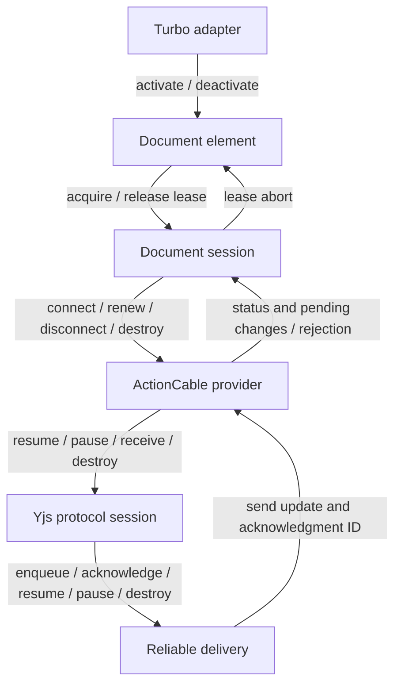

# Client lifecycles

Five objects each own one lifetime. They talk through method calls, status
events, and lease aborts, and none of them writes another's state.

| Owner | States | Where the rules live |
| --- | --- | --- |
| `DocumentSession` | open, refreshing, renewed, blocked, closed | `TRANSITIONS` table; `#settle` acts on the phase |
| `YrbyDocumentElement` | no phases: facts plus the current attempt | `#settle` |
| `ActionCableProvider` | disconnected, subscribing, connecting, connected, stopping, destroyed | `connect` and `#stop` |
| `YProtocolSession` | unsynced, synced, destroyed | `resume`, `pause`, `receive` |
| `ReliableSync` | paused, live, destroyed | `#updateTimer` |
| `TurboAdapter` | active, destroyed | `destroy` |
| `DocumentLease` | live, released | its abort signal; `release` aborts it |

## How the layers meet

A blocked session disconnects and aborts its leases. Each element hears the
abort, releases its editor, and goes inert. Queued edits stay with the session.
Retrying reconnects the session; discarding destroys it.

## The rules

Application code runs in the middle of our work: editor cleanup when a lease
is aborted, status and store listeners, `yrby:*` event listeners. Any of it can
call back in. The element and the session handle that with three rules:

1. **Commands act now; callbacks wait.** Explicit commands (`acquire`,
   `retry`, `discard`, and the element's deactivate, retarget, and destroy)
   take effect immediately. Turbo snapshots the page as soon as `before-cache`
   returns, and a retargeted editor must stop writing to the old document at
   once. Callbacks and async results (provider status and errors, lease
   aborts, consumer loading, first sync) only record what happened and ask for
   a settle.
2. **Settle decides.** Each object schedules at most one `#settle()` at a time,
   as a microtask, so it runs once the current call stack has finished. It
   compares the current facts with what exists and fixes the difference, so an
   extra settle is harmless.
3. **Our state is final before application code runs.** Phase, store
   membership, and the current attempt are updated first. Releasing leases,
   which runs editor cleanup, comes after.

The provider, protocol, and delivery layers (released in 0.5.0) keep their
own synchronous rules, described below.

## Sessions

`TRANSITIONS` lists every legal phase change. `#transition` is the only code
that changes the phase, and it never calls out.

| Event | Result |
| --- | --- |
| acquire | Add a lease; connect now in open or renewed (not allowed once closed) |
| release | Remove the lease; clear presence after the last one |
| retry | From blocked: clear the error, enter open, connect now |
| discard | Close now: leave the store, release leases, destroy the provider and doc |
| provider status | Ignored while blocked or closed. A connected renewed grant enters open. |
| rejection | From open with a refresh URL: enter refreshing and fetch a grant. Otherwise block. |
| refresh result | If the refreshing state that started it is still current: enter renewed and resubscribe with the new grant, or block on failure |
| connect failure | Block |
| other error | Record it, unless closed |

Settle then does two things. It releases the leases a blocked session held
when it blocked; a lease acquired while blocked is kept for `retry()`. And it
closes a session with no leases and nothing to deliver. After that it tells
store observers once. A connect failure only blocks, so it can't loop.

Editor cleanup can make a final edit when its lease is released. That edit is
queued before settle checks whether anything is left to deliver, so the
session stays open until the server acknowledges it. Closing leaves the store
before releasing leases, so cleanup can acquire a fresh replacement.

## Elements

The element has no phase machine. It binds when three facts hold: it is in
the page, the Turbo adapter says the page is live (`activate`/`deactivate`),
and its attributes name a document. `#settle` compares that with the current
attempt: one try at binding one document, which records its consumer, lease,
first sync, and any failure as they arrive.

- Settle starts an attempt, acquires once the consumer has loaded, and
  announces readiness after the first sync. That releases inert, resolves
  `whenSynced`, and dispatches `yrby:synced`.
- Removal is handled at settle, so a same-turn DOM move keeps its binding.
- An adapter activation after caching uses the adapter's latest word, so a
  queued settle can never wake a page Turbo has cached.
- Abandoning an attempt holds the element inert and replaces `whenSynced`, so
  the old promise never resolves for an abandoned attempt.
- An attempt records why it ended when that happens: the consumer or acquire
  failed, the session blocked, or the session was discarded.
  - Blocked: the element fires `yrby:error` and stalls. It watches that
    session and binds again once the session is retried or discarded.
  - Discarded: the element starts over with a fresh session.
  - Failed: the element fires `yrby:error` and stalls until the next page
    render.
  An attribute change or re-insertion always retries.
- An element whose attributes do not name a document yet (no grant or name)
  simply waits; nothing is loaded and nothing is reported.

## Providers

Each `connect()` creates an attempt object. Cable callbacks carry it and run
only while that attempt is connecting or connected. A consumer that calls back
inside `create()` is deferred one microtask, until the subscription is
installed. If `disconnect()` or `destroy()` runs inside `create()`, the
returned subscription is unsubscribed.

`#stop` handles disconnect, rejection, and destroy. With a live subscription
it enters stopping, removes our presence (the old subscription may still send
that one frame), pauses the protocol, and schedules the unsubscribe for the
next microtask. A `destroy()` during those calls upgrades the stop reason.
Destroyed is terminal. Send failures are reported only while the failing
subscription is still the current one.

The provider's awareness catches listener failures, so presence removal and
destruction always finish. Failures go through `onError`; a throwing `onError`
falls back to `console.warn`. If a status listener causes a newer status, the
older notification stops instead of delivering stale status to the remaining
listeners.

## Protocol

`resume` and `pause` each start a new handshake cycle. A receive interrupted
by a new cycle cannot mark that cycle synced or return a stale reply. Incoming
frames are fully validated before anything is applied. After `destroy`,
everything is a no-op. The protocol detaches from the doc and awareness it was
given but does not destroy them.

## Delivery

The retransmit timer runs exactly while delivery is live and the queue is not
empty; `#updateTimer` enforces that after every change. A tick checks that its
timer is still the current one. The injected `send`, `merge`, and timer
functions may call back in, so a queue version number lets a flush notice that
the queue changed during `merge`. Destroy clears the queue and is terminal.
Enqueue copies the caller's bytes, and `pending` returns copies, so callers
cannot mutate the queue.

## Adapter and leases

Only an active adapter schedules reconciliation. It leaves the per-document
registry before calling teardown callbacks, so those callbacks can register a
replacement. A lease's released state is `signal.aborted`; there is no second
flag.

## Test coverage

The unit suites exercise synchronous consumer callbacks, retries during
cleanup, late frames and timer ticks, canceled grant refreshes, and interrupted
handshakes. The browser suite runs four editors and a fresh reader against
Rails with ActionCable and AnyCable consumers, under Turbo and Turbolinks,
through navigation, offline edits, and reconnects.
