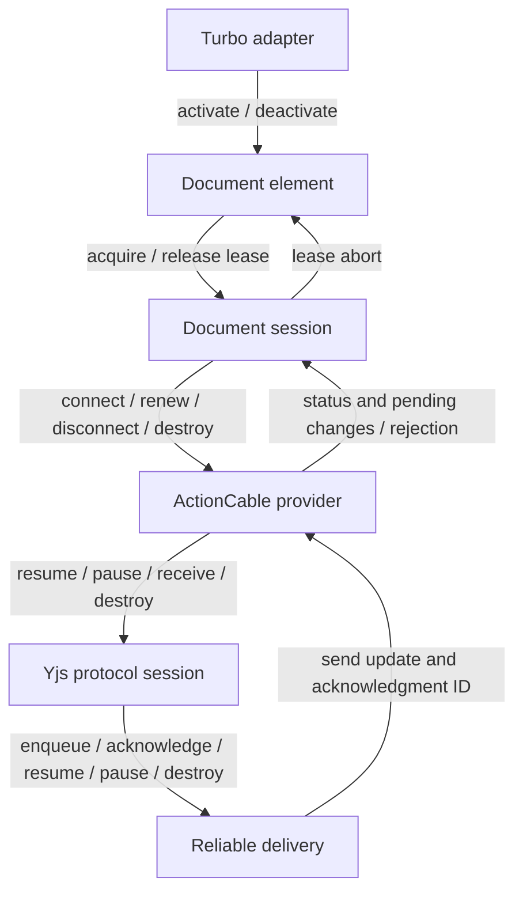

# Client lifecycles

Each layer owns its transitions and the resources attached to its current state.
The machines communicate through commands, status events, and lease aborts.
They do not write each other's state.

| Owner | States | Transition owner |
| --- | --- | --- |
| `DocumentSession` | open, refreshing, renewed, blocked, closed | `#transition` |
| `YrbyDocumentElement` | detached, inactive, idle, loading, syncing, ready | `#transition` |
| `ActionCableProvider` | disconnected, subscribing, connecting, connected, stopping, destroyed | `#transition` |
| `YProtocolSession` | unsynced, synced, destroyed | `#transition` |
| `ReliableSync` | paused, idle, sending, destroyed | `#transition` |
| `TurboAdapter` | active, destroyed | `destroy` is its only lifecycle transition |
| `DocumentLease` | live, released | the native abort signal; `release` aborts it |

## How the layers meet

A blocked session retires its connection and aborts its leases. The element's
lease-abort event releases the editor and holds it inert. Queued edits remain
owned by the session. Retrying reconnects that session; discarding destroys it.

## Ownership rules

**Sessions.** Refreshing and renewed are substates of the public `open` state.
The transition table prevents another refresh until a renewed grant is accepted.
A pending refresh captures its originating state object. After block, retry, or
close, that response cannot change the session. Closing removes the session from
the store before editor cleanup can acquire a replacement.

**Elements.** Only syncing and ready states contain a lease. Inactive waits for
the adapter; idle is already activated and may bind after descriptor changes
settle. DOM membership comes from `isConnected`. Same-turn moves retain the
binding, but async completions cannot bind or announce readiness while removed.
Readiness is replaced when an attempt or lease is abandoned.

**Providers.** Subscribing reserves the attempt before calling the consumer.
Callbacks fired during `create` wait until its returned subscription is installed.
Connecting and connected own a connection. Each callback and asynchronous send
result must still belong to that connection. The stopping state rejects incoming
callbacks while allowing the retiring subscription to send its presence removal.
Its reason records whether to disconnect, report rejection, or finish destruction;
a destroy request during cleanup supersedes disconnection. Unsubscribe is deferred
one microtask so the removal frame can flush. Destroyed is terminal.

Provider status is a projection of the provider and protocol states. `#last` is
only a notification cache. If a listener causes a newer transition, the older
notification stops rather than delivering stale status to the remaining listeners.
The page-handler pair is a resource; retired handlers cannot restore old presence.

**Protocol.** Resume and pause begin new handshake cycles. Catch-up retains its
cycle, so a synchronous handshake reply is valid. A receive interrupted by a
new cycle cannot mark that cycle synced or return an obsolete reply. Destroyed
sessions ignore later receive, bootstrap, resume, pause, and presence-removal calls.
The protocol detaches from externally owned docs and awareness; it does not destroy
them.

**Delivery.** Paused retains the queue; idle is resumed with an empty queue;
sending owns its retransmission timer. Queue changes select idle or sending.
Leaving sending cancels that timer. Its callback checks the sending-state identity,
so a queued tick cannot retransmit a later queue. Timer ownership is established
before sending: a synchronous acknowledgment or pause can clean it up immediately.
Destroy clears the queue and is terminal.

**Adapter and leases.** Only an active adapter may schedule reconciliation. It
leaves the per-document registry before invoking teardown callbacks, so those
callbacks can register a replacement safely. A lease derives release state from
`signal.aborted`; there is no second released flag to keep synchronized.

## Data is not another lifecycle

Pending updates, acknowledgment sequence numbers, merge caches, lease collections,
listeners, readiness promises, and parked presence/inert values remain ordinary
data. `hasPending` derives from the queue. There are no separate connected,
destroyed, synced, released, active, or attaching booleans to combine by hand.

The unit suites exercise synchronous consumer callbacks, retries during cleanup,
late frames and timer ticks, canceled grant refreshes, and interrupted handshakes.
The browser suites cover Rails, ActionCable/AnyCable, Turbo/Turbolinks, navigation,
offline delivery, grant renewal, and editor bindings.
