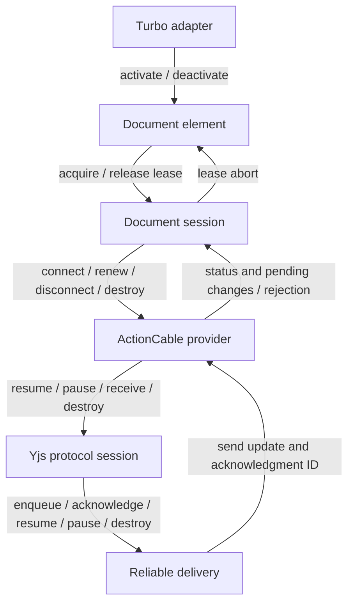

# Client lifecycles

Five objects each own one lifetime. They talk through method calls, status
events, and lease aborts, and none of them writes another's state.

| Owner | States | Where the rules live |
| --- | --- | --- |
| `DocumentSession` | open, refreshing, renewed, blocked, closed | `TRANSITIONS` table and `#transition` |
| `YrbyDocumentElement` | detached, inactive, idle, loading, syncing, ready | `requests` table and `#setState` |
| `ActionCableProvider` | disconnected, subscribing, connecting, connected, stopping, destroyed | `connect` and `#stop` |
| `YProtocolSession` | unsynced, synced, destroyed | `resume`, `pause`, `receive` |
| `ReliableSync` | paused, live, destroyed | `#updateTimer` |
| `TurboAdapter` | active, destroyed | `destroy` |
| `DocumentLease` | live, released | its abort signal; `release` aborts it |

## How the layers meet

A blocked session disconnects and aborts its leases. Each element hears the
abort, releases its editor, and goes inert. Queued edits stay with the session.
Retrying reconnects the session; discarding destroys it.

## One rule that applies everywhere

Application callbacks run synchronously in the middle of our own work: editor
cleanup, status listeners, awareness listeners, injected timers, store
listeners. Any of them can call back in and change state. So work that calls
out checks afterwards that it still owns the state it started from, usually
by comparing an identity object (a state, lease, attempt, cycle, or timer).
That check is the reason for most of the short `if (this.#state !== x) return`
lines.

## Sessions

`TRANSITIONS` lists every legal phase change; `#transition` is the only code
that changes the phase. Refreshing and renewed are substates of the public
`open` state.

| Event | Allowed when | Result |
| --- | --- | --- |
| acquire | not closed | Add a lease; connect in open or renewed |
| release | the lease is still held | Remove it; clear presence after the last lease |
| retry | blocked | Clear the error, enter open, reconnect |
| discard | not closed | Close and destroy the session |
| provider status | open, refreshing, renewed | A connected renewed grant enters open |
| rejection | open with a refresh URL | Enter refreshing and fetch a grant |
| rejection | anything else that is not blocked or closed | Block |
| refresh result | the refreshing state that started it is still current | Enter renewed and resubscribe, or block on failure |
| connect failure | the state that started it is still current | Block |
| other error | not closed | Record the error |

Every entry point runs inside `#batch`. When the outermost batch ends, a
session with no leases and nothing to deliver closes, then observers get one
change notification. Blocked sessions never close on their own. Closing
removes the session from the store before releasing leases, so editor cleanup
can acquire a fresh replacement. Blocking snapshots its leases before releasing
them for the same reason.

## Elements

The `requests` table lists each outside request (connect, activate, resume,
retarget, deactivate, destroy), the phases it may leave, and its target. Any
other request is a no-op. Adapter activation can wake an inactive element; a
queued resume after an attribute change wakes only an idle one, so it cannot
undo a Turbo cache deactivation.

Async results (consumer loaded, lease acquired, first sync, lease aborted) are
not in the table. Each one carries the state that started it and does nothing
if the element has moved on or left the DOM.

Loading, syncing, and ready are one attempt moving forward with one lease.
`#setState` treats any other move out of an attempt as abandoning it: it
replaces the `whenSynced` promise, holds the element inert, and releases the
lease. Releasing runs editor cleanup, which can retarget or remount the
element, so the new phase's work starts only if the state is still the one
just set.

## Providers

Each `connect()` creates an attempt object. Cable callbacks carry it and run
only while that attempt is connecting or connected. A consumer that calls back
inside `create()` is deferred one microtask, until the subscription is
installed. If `disconnect()` or `destroy()` runs inside `create()`, the
returned subscription is unsubscribed.

`#stop` handles disconnect, rejection, and destroy. With a live subscription
it enters stopping, removes our presence (the old subscription may still send
that one frame), pauses the protocol, and schedules the unsubscribe for the
next microtask. A `destroy()` during those calls upgrades the stop reason.
Destroyed is terminal. Send failures are reported only while the failing
subscription is still the current one.

The provider's awareness catches listener failures, so presence removal and
destruction always finish. Failures go through `onError`; a throwing `onError`
falls back to `console.warn`. If a status listener causes a newer status, the
older notification stops instead of delivering stale status to the remaining
listeners.

## Protocol

`resume` and `pause` each start a new handshake cycle. A receive interrupted
by a new cycle cannot mark that cycle synced or return a stale reply. Incoming
frames are fully validated before anything is applied. After `destroy`,
everything is a no-op. The protocol detaches from the doc and awareness it was
given but does not destroy them.

## Delivery

The retransmit timer runs exactly while delivery is live and the queue is not
empty; `#updateTimer` enforces that after every change. A tick checks that its
timer is still the current one. The injected `send`, `merge`, and timer
functions may call back in, so a queue version number lets a flush notice that
the queue changed during `merge`. Destroy clears the queue and is terminal.
Enqueue copies the caller's bytes, and `pending` returns copies, so callers
cannot mutate the queue.

## Adapter and leases

Only an active adapter schedules reconciliation. It leaves the per-document
registry before calling teardown callbacks, so those callbacks can register a
replacement. A lease's released state is `signal.aborted`; there is no second
flag.

## Test coverage

The unit suites exercise synchronous consumer callbacks, retries during
cleanup, late frames and timer ticks, canceled grant refreshes, and interrupted
handshakes. The browser suite runs four editors and a fresh reader against
Rails with ActionCable and AnyCable consumers, under Turbo and Turbolinks,
through navigation, offline edits, and reconnects.
