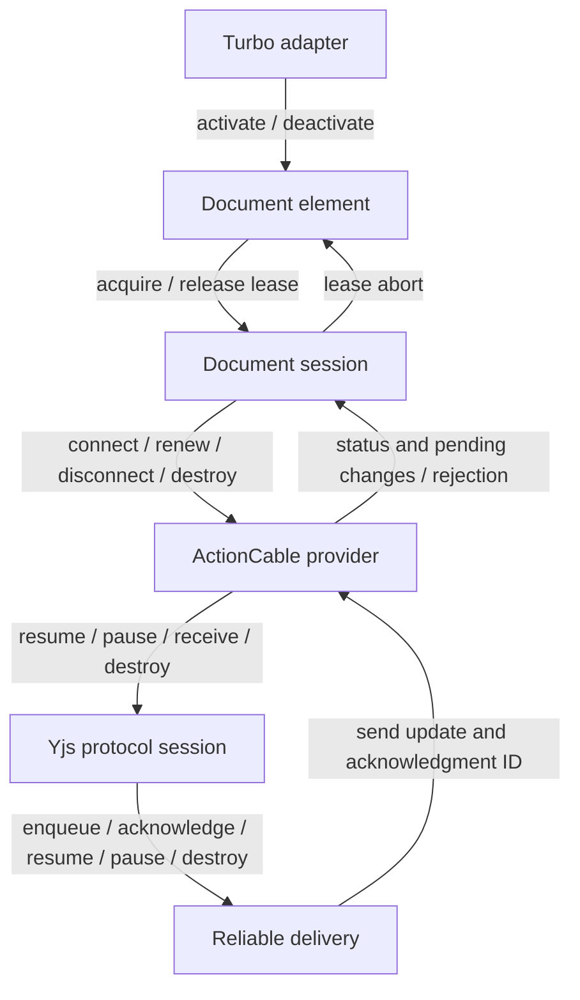

# Client lifecycles

Each object below owns one lifetime. They talk to each other through method
calls, status events, and lease aborts. None of them writes another one's
state.

| Owner | States | Where the rules live |
| --- | --- | --- |
| `DocumentSession` | open, refreshing, renewed, blocked, closed | `PHASES` table; `#settle` acts on the phase |
| `YrbyDocumentElement` | no phases: facts plus the current attempt | `#settle` |
| `ActionCableProvider` | disconnected, subscribing, connecting, connected, stopping, destroyed | `connect` and `#stop` |
| `YProtocolSession` | unsynced, synced, destroyed | `resume`, `pause`, `receive` |
| `ReliableSync` | paused, live, destroyed | `#updateTimer` |
| `TurboAdapter` | active, destroyed | `destroy` |
| `DocumentLease` | live, released | its abort signal; `release` aborts it |

## How the layers meet

```mermaid
flowchart TD
  Turbo[Turbo adapter] -->|activate / deactivate| Element[Document element]
  Element -->|acquire / release lease| Session[Document session]
  Session -->|lease abort| Element
  Session -->|connect / renew / disconnect / destroy| Provider[ActionCable provider]
  Provider -->|status and pending changes / rejection| Session
  Provider -->|resume / pause / receive / destroy| Protocol[Yjs protocol session]
  Protocol -->|enqueue / acknowledge / resume / pause / destroy| Delivery[Reliable delivery]
  Delivery -->|send update and acknowledgment ID| Provider
```

A blocked session disconnects and aborts its leases. Each element is told
about the abort, releases its editor, and goes inert. Queued edits are kept by
the session. Retrying reconnects the session. Discarding destroys it.

## The rules

Application code runs in the middle of our work. Editor cleanup runs when a
lease is aborted, and status listeners, store listeners, and `yrby:*` event
listeners run whenever we notify them. Any of that code can call back into us.
The element and the session follow three rules to cope with that:

1. **Commands act now; callbacks wait.** Explicit commands (`acquire`,
   `retry`, `discard`, and the element's deactivate, retarget, and destroy)
   take effect right away. Turbo copies the page as soon as `before-cache`
   returns, and after a retarget the editor has to stop writing to the old
   document before anything else runs. Callbacks and async results (provider
   status and errors, lease aborts, consumer loading, first sync) write down
   what happened and ask for a settle.
2. **Settle decides.** Each object schedules at most one `#settle()` at a time,
   as a microtask, so it runs after the current call stack finishes. Settle
   compares the current facts with what exists and fixes the difference. An
   extra settle is harmless.
3. **Our state is final before application code runs.** Phase, store
   membership, and the current attempt are updated first. Leases are released
   after that, and releasing them is what runs editor cleanup.

The provider, protocol, and delivery layers (released in 0.5.0) keep their
own synchronous rules, described below.

## Sessions

`PHASES` lists, for each phase, the state apps see, whether a new lease
connects, and which moves are allowed. `#transition` is the only code that
changes the phase. It does not call out.

| Event | Result |
| --- | --- |
| acquire | Add a lease; connect now in open or renewed (not allowed once closed) |
| release | Remove the lease; clear presence after the last one |
| retry | From blocked: clear the error, enter open, connect now |
| discard | Close now: leave the store, release leases, destroy the provider and doc |
| provider status | Ignored while blocked or closed. A connected renewed grant enters open. |
| rejection | From open with a refresh URL: enter refreshing and fetch a grant. Otherwise block. |
| refresh result | If the refreshing state that started it is still current: enter renewed and resubscribe with the new grant, or block on failure |
| connect failure | Block |
| other error | Record it, unless closed |

Settle then does two things. It releases the leases a blocked session was
holding when it blocked. A lease acquired while blocked is kept for `retry()`.
It also closes a session that has no leases and nothing left to deliver. After
that it notifies store observers once. A connect failure only blocks, so it
can't loop.

Editor cleanup can make a final edit when its lease is released. That edit is
queued before settle checks whether anything is left to deliver, so the
session stays open until the server acknowledges it. Closing leaves the store
before releasing leases, so cleanup can acquire a fresh replacement.

## Elements

The element has no phase machine. It binds when three facts hold. It is in
the page, the Turbo adapter says the page is live (`activate`/`deactivate`),
and its attributes name a document. `#settle` compares those facts with the
current attempt. An attempt is one try at binding one document. It records
its consumer, lease, first sync, and any failure as they arrive.

- Settle starts an attempt, acquires a lease once the consumer has loaded, and
  announces readiness after the first sync. Announcing clears inert, resolves
  `whenSynced`, and dispatches `yrby:synced`.
- Removal is handled at settle, so a same-turn DOM move keeps its binding.
- Settle reads the adapter's most recent activate or deactivate, so a queued
  settle cannot bind a page Turbo has cached.
- Abandoning an attempt makes the element inert and replaces `whenSynced`. The
  old promise is left unresolved.
- If the session blocks (reported with `yrby:error`), is discarded, or the
  consumer fails to load, the attempt records the reason as soon as it happens
  and the element stalls on that document. It tries again after the next page
  render, an attribute change, or a re-insertion.

## Providers

Each `connect()` creates an attempt object. Cable callbacks carry it and run
only while that attempt is connecting or connected. If a consumer calls back
from inside `create()`, those callbacks are deferred one microtask, until the
subscription is installed. If `disconnect()` or `destroy()` runs inside
`create()`, the subscription `create()` returns is unsubscribed.

`#stop` handles disconnect, rejection, and destroy. When there is a live
subscription it enters stopping, removes our presence (the old subscription is
still allowed to send that one frame), pauses the protocol, and schedules the
unsubscribe for the next microtask. A `destroy()` during those calls upgrades
the stop reason. Destroyed is terminal. A send failure is reported only if the
subscription that failed is still the current one.

The provider's awareness catches listener failures, so presence removal and
destruction always finish. Failures go through `onError`. If `onError` itself
throws, the provider falls back to `console.warn`. If a status listener
triggers a newer status, the older notification stops there, so the remaining
listeners do not get a stale status.

## Protocol

`resume` and `pause` each start a new handshake cycle. If a new cycle starts
in the middle of a receive, that receive does not mark the new cycle synced
and does not return a stale reply. A frame's structure is checked before
anything is applied, and a presence payload is read in full first. A damaged
Yjs update inside a well-formed frame is reported through `onError`. After
`destroy`, every method is a no-op. The protocol detaches from the doc and
awareness it was given. It does not destroy them.

## Delivery

The retransmit timer runs only while delivery is live and the queue is not
empty. `#updateTimer` checks that after every change. A tick first
checks that its timer is still the current one. The injected `send`, `merge`,
and timer functions may call back in, so a flush compares a queue version
number before and after `merge` to notice if the queue changed underneath it.
Destroy clears the queue and is terminal. Enqueue copies the caller's bytes
and `pending` returns copies, so callers cannot mutate the queue.

## Adapter and leases

Only an active adapter schedules reconciliation. On destroy it leaves the
per-document registry before calling teardown callbacks, so those callbacks
can register a replacement. A lease has one released flag, `signal.aborted`.

## Test coverage

The unit suites cover synchronous consumer callbacks, retries during cleanup,
late frames and timer ticks, canceled grant refreshes, and interrupted
handshakes. The browser suite runs four editors and a fresh reader against
Rails, with ActionCable and AnyCable consumers, under Turbo and Turbolinks,
through navigation, offline edits, and reconnects.
