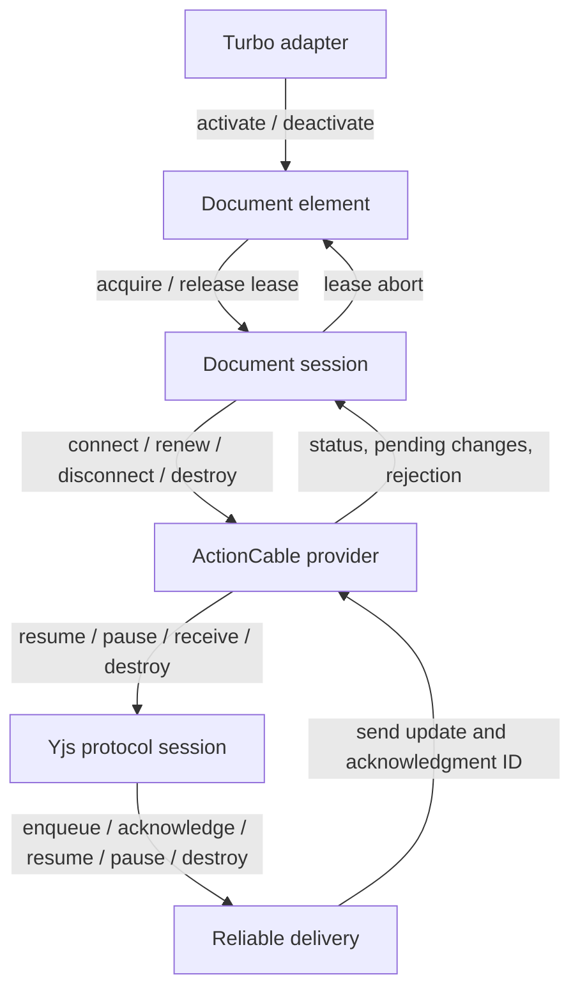

# Client lifecycles

Each object below manages one lifetime. The objects communicate through method
calls, status events, and lease aborts, and none of them writes another
object's state.

| Object | States | Where the rules live |
| --- | --- | --- |
| `DocumentSession` | open, refreshing, renewed, blocked, closed | The `PHASES` table, and `#settle`, which acts on the phase |
| `YrbyDocumentElement` | None. It tracks facts and the current attempt | `#settle` |
| `ActionCableProvider` | disconnected, subscribing, connecting, connected, stopping, destroyed | `connect` and `#stop` |
| `YProtocolSession` | unsynced, synced, destroyed | `resume`, `pause`, `receive` |
| `ReliableSync` | paused, live, destroyed | `#updateTimer` |
| `TurboAdapter` | active, destroyed | `destroy` |
| `DocumentLease` | live, released | Its abort signal, which `release` aborts |

## How the layers meet

```mermaid
flowchart TD
  Turbo[Turbo adapter] -->|activate / deactivate| Element[Document element]
  Element -->|acquire / release lease| Session[Document session]
  Session -->|lease abort| Element
  Session -->|connect / renew / disconnect / destroy| Provider[ActionCable provider]
  Provider -->|status, pending changes, rejection| Session
  Provider -->|resume / pause / receive / destroy| Protocol[Yjs protocol session]
  Protocol -->|enqueue / acknowledge / resume / pause / destroy| Delivery[Reliable delivery]
  Delivery -->|send update and acknowledgment ID| Provider
```

A blocked session disconnects and aborts its leases. Each element sees its
lease abort, releases its editor, and goes inert, while the session keeps the
queued edits. Retrying reconnects the session, and discarding destroys it.

## The rules

Application code can run while the element or session is partway through an
operation. Editor cleanup runs when a lease aborts, and status listeners, store
listeners, and `yrby:*` event listeners run whenever we notify them. Any of
that code can call back into us, so the element and the session follow three
rules.

1. Explicit commands (`acquire`, `retry`, `discard`, and the element's
   deactivate, retarget, and destroy) take effect immediately. Turbo copies the
   page as soon as `before-cache` returns, and after a retarget the editor has
   to stop writing to the old document before anything else runs. Callbacks
   and async results (provider status and errors, lease aborts, consumer
   loading, first sync) record what happened and request a settle.
2. Each object schedules at most one `#settle()` at a time. It runs as a
   microtask after the current call stack finishes, compares the current facts
   with what exists, and fixes any difference. An extra settle does no harm.
3. The element and the session update the phase, store membership, and current
   attempt before they release any leases, because releasing a lease runs
   editor cleanup.

The provider, protocol, and delivery layers shipped in 0.5.0 and follow their
own synchronous rules, described below.

## Sessions

For each phase, `PHASES` lists the state apps see, whether a new lease
connects, and which transitions are allowed. Only `#transition` changes the
phase, and it does not call out to other code.

| Event | Result |
| --- | --- |
| acquire | Add a lease and connect immediately if open or renewed. Not allowed once closed |
| release | Remove the lease, and clear presence after the last one |
| retry | From blocked, clear the error, enter open, and connect immediately |
| discard | Close immediately. Leave the store, release leases, and destroy the provider and doc |
| provider status | Ignored while blocked or closed. A connected renewed grant enters open. |
| rejection | From open with a refresh URL, enter refreshing and fetch a grant. Otherwise, block. |
| refresh result | If the refreshing state that started it is still current, enter renewed and resubscribe with the new grant, or block on failure |
| connect failure | Block |
| other error | Record it unless closed |

After an event, settle releases the leases a blocked session held when it
blocked, and keeps any lease acquired while blocked for `retry()`. It also
closes a session that has no leases and nothing left to deliver, then notifies
store observers once. A connect failure only blocks, so it can't cause a loop.

Editor cleanup can make one last edit when its lease is released. The session
queues that edit before settle checks for undelivered work, so the session
remains open until the server acknowledges it. Closing removes the session from
the store before releasing leases, so cleanup can acquire a replacement
session.

## Elements

The element has no phase machine. It binds when it is in the page, the Turbo
adapter reports the page as live (through `activate` and `deactivate`), and its
attributes name a document. `#settle` compares those facts with the current
attempt, which is one try at binding one document. The attempt records its
consumer, lease, first sync, and any failure as each one arrives.

- Settle starts an attempt and acquires a lease once the consumer loads. After
  the first sync, it clears `inert`, resolves `whenSynced`, and dispatches
  `yrby:synced`.
- Settle handles removal, so an element moved within the same turn keeps its
  binding.
- Settle reads the adapter's most recent activate or deactivate, so a queued
  settle cannot bind a page Turbo has cached.
- Abandoning an attempt makes the element inert and replaces `whenSynced`,
  leaving the old promise unresolved.
- If the session blocks or is discarded, or the consumer fails to load, the
  attempt records why right away and the element stops binding that document.
  A block also dispatches `yrby:error`. The element tries again after the next
  page render, an attribute change, or a re-insertion.

## Providers

Each `connect()` creates an attempt object. The cable callbacks hold a
reference to it and run only while that attempt is connecting or connected. If
a consumer invokes callbacks from inside `create()`, the provider defers them
one microtask, until the subscription is installed. If `disconnect()` or
`destroy()` runs inside `create()`, the provider unsubscribes the subscription
that `create()` returns.

`#stop` handles disconnect, rejection, and destroy. With a live subscription,
it enters stopping, removes our presence, pauses the protocol, and schedules
the unsubscribe for the next microtask. The old subscription may still send
that one presence frame. A `destroy()` during those calls upgrades the stop
reason, and destroyed is a terminal state. The provider reports a send failure
only if the subscription that failed is still the current one.

The provider's awareness catches listener failures, so presence removal and
destruction always finish. Failures go to `onError`, and if `onError` itself
throws, the provider falls back to `console.warn`. When a status listener
triggers a newer status, the provider stops delivering the older one, so the
remaining listeners don't receive a stale status.

## Protocol

`resume` and `pause` each start a new handshake cycle. If a new cycle starts
during a `receive`, that receive neither marks the new cycle synced nor returns
a stale reply. The protocol checks a frame's structure before applying
anything, and reads a presence payload in full before using it. A damaged Yjs
update inside a well-formed frame goes to `onError`. After `destroy`, every
method does nothing, and the protocol detaches from the doc and awareness it
was given without destroying them.

## Delivery

The retransmit timer runs only while delivery is live and the queue has
entries, and `#updateTimer` rechecks that after every change. Each tick first
confirms that its timer is still the current one. The injected `send`, `merge`,
and timer functions may call back in, so a flush compares a queue version
number before and after `merge` to detect a queue change made during the call.
Destroy clears the queue and is final. `enqueue` copies the caller's bytes and
`pending` returns copies, so callers can't modify the queue.

## Adapter and leases

Only an active adapter schedules reconciliation. On destroy, it removes itself
from the per-document registry before calling teardown callbacks, so those
callbacks can register a replacement. A lease tracks release with one flag,
`signal.aborted`.

## Test coverage

The unit suites cover synchronous consumer callbacks, retries during cleanup,
late frames and timer ticks, canceled grant refreshes, and interrupted
handshakes. The browser suite runs four editors and a fresh reader against
Rails through navigation, offline edits, and reconnects, with ActionCable and
AnyCable consumers under both Turbo and Turbolinks.
