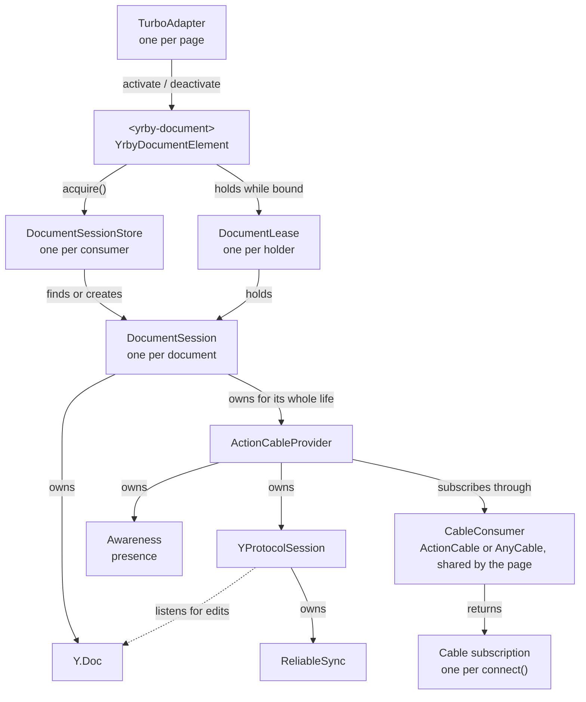

# yrby-client

The JavaScript client for yrby's Yjs protocol. Most Rails apps import
`yrby-client/element` and bind an editor when it emits `yrby:synced`.
Applications that manage their own editor lifetime can use
`DocumentSessionStore` directly.

The client has five layers:

- **`<yrby-document>`** attaches an editor while its page is live, but not on a
  Turbo or Turbolinks preview.
- **`DocumentSessionStore`** keeps a document and its pending work after an
  editor detaches. Callers hold a session through a lease.
- **`ActionCableProvider`** manages one ActionCable or AnyCable subscription and
  translates its JSON envelopes to protocol frames.
- **`YProtocolSession`** handles the Yjs handshake, frames, and awareness for
  any transport.
- **`ReliableSync`** keeps local updates until the server acknowledges them and
  replays the unacknowledged tail after a reconnect.

`<yrby-document>` builds on each layer below it, in that order. The provider,
protocol session, and zero-dependency delivery core also work on their own.

### How the classes relate



Read each arrow as a sentence, such as "DocumentSession owns
ActionCableProvider for its whole life." Signals flow back up in the other
direction. The provider reports status and rejections to its session, and a
session that blocks or is discarded aborts its leases, which releases each
element's editor. Elements that name the same document share one session, and
that session keeps their pending edits after the last element is gone.

### How the element and session behave

Editor cleanup, status listeners, and `yrby:*` event listeners are your code,
and they can call back into the element or session while it's partway through
something. Both classes follow three rules to stay consistent:

1. Calls you make (`acquire`, `retry`, `discard`, and the element's
   deactivate, retarget, and destroy) take effect right away. Turbo copies the
   page as soon as `before-cache` returns, and a retargeted editor has to stop
   writing to the old document immediately.
2. Callbacks and async results (provider status and errors, lease aborts, the
   consumer loading, the first sync) record what happened and schedule a
   settle. A settle runs as a microtask after the current call stack, compares
   what should exist with what does, and fixes the difference. Each object has
   at most one settle pending, and an extra one does no harm.
3. They update their own state before releasing any lease, because releasing a
   lease runs your editor cleanup.

The session's allowed phase transitions live in the `PHASES` table in
`src/document_session.ts`.

## Install

```bash
npm install yrby-client
```

`ActionCableProvider` needs `yjs`, `y-protocols`, and an ActionCable/AnyCable
consumer. `YProtocolSession` needs `yjs` and `y-protocols`, but takes raw frames
from any transport. `ReliableSync` has **no dependencies**. If that's all you
want, import it from `yrby-client/reliable`.

Written in **TypeScript** and ships bundled type declarations, so TS projects get
full types (typed options, methods, and errors) with no `@types` package — and
plain-JS projects use the same compiled ESM with nothing extra to install.

## `<yrby-document>` (the easiest path)

yrby-rails' `collaborative_document_tag` renders this element with a signed
grant. Like `<turbo-cable-stream-source>` with `turbo_stream_from`, it connects
automatically once you import the element:

```js
import "yrby-client/element";

document.addEventListener("yrby:synced", ({ target, detail }) => {
  const editor = bindYourEditor(target, detail.doc, detail.provider);
  detail.signal.addEventListener("abort", () => editor.destroy(), { once: true });
});
```

`bindYourEditor` stands for your application's editor binding. Its cleanup
must detach Yjs listeners and disable or remove editor controls. It must not
destroy the document or provider, which belong to the session, or disconnect
the shared consumer. The abort signal fires before yrby checks whether a final
update still needs delivery, and you should handle it even if the editor has
already left the DOM.

A document session holds the `Y.Doc`, the provider, and any unacknowledged
edits, and the element attaches an editor to that session. Removing the last
editor clears presence and, if nothing is pending, releases the session. A
session with pending edits keeps delivering them under its original grant
until the server acknowledges them. A rejection stops the retries and keeps
the work in memory for recovery, but it does not count as an acknowledgment.

The element listens for both Turbo and Turbolinks 5 lifecycle events. A cached
preview is inert and creates no document or provider, and the cached markup
holds no CRDT snapshot. When you restore a page from history, the element
reattaches to a pending session if there is one, or loads the saved content
from Rails. A new grant gets its own session, and the previous session's edits
reach it through normal server sync. This all works within one tab and is not
offline storage, so closing or reloading the tab loses unacknowledged edits.

Moving the element within the same turn keeps its editor binding and document.
Remounting it after a delay reloads saved content, and the old `Y.Doc` and undo
stack are gone. Changing the grant, name, or channel aborts the old binding
immediately and acquires a session for the new combination. The old session
keeps any pending work under its original authorization.

The element exposes its current `session`, `doc`, and `provider`. These are
unavailable before the element acquires a session and while it is retargeting,
and reading them never creates a document. `whenSynced` is always a promise,
even before the consumer is initialized, and it resolves after the current
session's first catch-up. If the lease is abandoned, that promise never
resolves. The bubbling `yrby:synced` event fires once per lease and includes
`detail.signal` for cleanup. Being synced doesn't mean the connection is online
or that every edit has been acknowledged. Check `provider.synced` and
`session.hasPending` for those.

Import failures and subscription rejections emit `yrby:error` with
`detail.error`, and a rejection also includes `detail.session` for you to
retry. The element is inert while its session is blocked. After retrying the
session, call `element.activate()` or remount the element to attach again.
`element.destroy()` releases the lease and stops automatic binding until the
element is reinserted, without discarding pending edits.

The `refresh` attribute names a same-origin URL that returns a new grant for
this document as JSON, `{ "grant": "..." }`. When the server rejects the
subscription, as it does when a grant has expired and the cable reconnects,
the session fetches that URL with the browser's session cookies and resubscribes
with the new grant. It keeps the same document, pending edits, and
acknowledgment route. Your application decides whether to issue each grant, so
every request is a fresh permission check, and the session only fetches after a
rejection. It tries one renewal per rejection. If the refresh fails, takes
longer than 15 seconds, or the server rejects the renewed grant too, the
session blocks as it would without the attribute. The session reads the
attribute when it is acquired, and changing it later does not rebind the
editor.

The default element needs `@rails/actioncable`, `yjs`, and `y-protocols`. All
default elements share one consumer and one import of it while that import is
loading. For AnyCable, assign an ActionCable-compatible consumer before adding
any elements:

```js
import { YrbyDocumentElement } from "yrby-client/element";
import { createConsumer } from "@anycable/web";

YrbyDocumentElement.consumer = createConsumer();
```

## Document sessions

Each consumer has its own store. Two acquisitions with the same
`{ channel, grant, name }` share one document and one queue. The client
compares grants as strings and does not decode them to work out whether two
grants point at the same record. Each session adds an opaque `session_id`
subscription parameter so the server can route acknowledgments to it. The
server does not use that parameter to select or authorize a document.

A headless workflow can hold a lease for as long as it runs:

```js
import { DocumentSessionStore } from "yrby-client";

const store = DocumentSessionStore.for(consumer);
const lease = store.acquire({ grant, name: "body" });
const { session } = lease;
await session.whenSynced;
// Work with session.doc, and hold the lease until the workflow finishes.
lease.release(); // safe to call more than once, and pending work keeps sending
```

Call `lease.setPresence(state)` when an editor gains focus and
`lease.setPresence(null)` when it blurs. All views of one session share one
presence, so the last call wins. An editor binding gets its lease from
`detail.lease` on `yrby:synced`.

`session.state` is `open`, `blocked`, or `closed`, independent of the
provider's transport status. The store emits `change` with the session in
`event.detail`, which you can use to report delivery failures after the page
that made the edits is gone.

```js
store.addEventListener("change", ({ detail: session }) => {
  if (session.state === "blocked") reportDeliveryFailure(session.error, session);
});
```

Sessions hold their queues while the consumer is down and deliver them when it
reconnects. A new consumer gets a new store and does not pick up another
consumer's queued work.

A blocked session holds its document and pending edits in memory. `retry()`
reconnects with the session's current grant, which is the original one or the
last one its `refresh` URL returned. `discard()` drops the work, and cache
eviction does not discard unsaved work. A grant that arrives any other way,
such as a new element attribute, starts a separate session and leaves the
blocked one blocked.

## ActionCableProvider (the easy path)

```js
import { ActionCableProvider } from "yrby-client";
import * as Y from "yjs";
import { createConsumer } from "@anycable/web"; // or @rails/actioncable

const doc = new Y.Doc();
const consumer = createConsumer();
const provider = new ActionCableProvider(doc, consumer, "DocumentChannel", { id: docId });

provider.connect(); // does not auto-connect — wire your editor binding first

// Observe the connection (one signal, no separate "sync" event):
provider.onStatusChange(({ status, pending }) => render(status, pending)); // returns an unsubscribe fn
//   "connecting"  -> subscription created, transport not up yet
//   "connected"   -> transport up, exchanging sync steps (show "syncing")
//   "synced"      -> caught up with the server
//   "disconnected"-> torn down via disconnect()/destroy()
//                    (a dropped transport ActionCable will retry shows as "connecting")
//   pending       -> true while local edits await acknowledgment
//                    (listeners fire when status or pending changes)

// provider.status     -> the current status (same union as above)
// provider.awareness  -> the provider's Awareness instance (always a fresh one)
// provider.synced     -> caught up with the server
// provider.whenSynced -> Promise for the FIRST catch-up (see below)
// provider.hasPending -> unacked local edits in flight
// provider.destroy()  -> tear down
```

Most rich-text bindings seed an empty document when they mount, so binding
before the server's state arrives makes each client insert its own
top-level node. Wait for the first sync before creating the editor:

```js
provider.connect();
await provider.whenSynced; // resolves immediately if already synced
// now hand the doc to the editor binding
```

It resolves once, on the first catch-up, and stays resolved across later
reconnects. Use `onStatusChange` to track the live connection.

After `disconnect()` or `destroy()`, the provider ignores callbacks from the
old subscription. If a consumer invokes callbacks while it is still creating
the subscription, the provider holds them until creation returns. A managed
session sets up its own acknowledgment route, separate from these guards.

On `disconnect()` / `destroy()` — and on browser `pagehide` — the provider
broadcasts a presence removal so peers drop your cursor immediately instead of
waiting for the awareness timeout. `destroy()` is synchronous (the unsubscribe is
deferred one microtask so that removal flushes first) and tears down the
`Awareness` it created. (`ActionCableProvider` always creates its own; to bring
your own `Awareness`, drop down to `YProtocolSession`, which leaves it for you to
own.)

On the server, include `Y::ActionCable` in a channel named
`DocumentChannel` (the [`yrby-rails`](https://rubygems.org/gems/yrby-rails)
gem). The server subscribes document broadcasts and AnyCable awareness whispers
on separate streams, so the document stream is not whisper-enabled. Need a
different transport or framing? Drop down to `YProtocolSession` and supply your
own `send`.

The provider uses one JSON envelope shape:

```txt
client -> server document frame      { update: "<base64 frame>", id: 42 }
server -> client document frame      { update: "<base64 frame>" }
server -> client acknowledgement     { ack: 42 }
AnyCable awareness whisper           { awareness: "<base64 awareness frame>" }
```

## YProtocolSession

```js
import { YProtocolSession, toBase64, fromBase64 } from "yrby-client";
import * as Y from "yjs";
import { Awareness } from "y-protocols/awareness";

const doc = new Y.Doc();
const awareness = new Awareness(doc);

const session = new YProtocolSession(doc, {
  awareness,
  // transmit one raw frame; `id` is set for reliable doc updates -> tag your envelope
  send: (frame, id) => {
    const payload = { update: toBase64(frame) };
    if (id !== undefined) payload.id = id;
    subscription.send(payload);
  },
});

// wire your transport's callbacks:
subscription.connected    = () => session.resume();         // handshake + replay
subscription.disconnected = () => session.pause();          // keep the queue, clear presence
subscription.received = (msg) => {
  if (msg.ack !== undefined) return session.acknowledge(msg.ack); // reliable ack envelope
  const reply = session.receive(fromBase64(msg.update));     // decode + apply
  if (reply) subscription.send({ update: toBase64(reply) });     // e.g. answer a SyncStep1
};
// session.synced -> caught up; session.hasPending -> unacked edits in flight
// session.destroy() -> detach listeners + stop retransmits
```

Local document edits and awareness changes are picked up automatically from the
doc's / awareness's `update` events — you never call anything for outbound edits.

Pass `onError(error, context)` (on either `ActionCableProvider` or
`YProtocolSession`) to observe dropped frames: a malformed or truncated message
is decoded defensively, dropped, and reported here rather than thrown into your
transport callback. Defaults to a `console.warn`.

The provider also sends failures from status listeners, awareness events, and
unsubscribe to `onError`. A failing awareness listener won't interrupt presence
removal or destruction, and if `onError` itself throws, the provider logs the
error and continues.

## ReliableSync (standalone)

```js
import { ReliableSync } from "yrby-client/reliable"; // zero-dep
import * as Y from "yjs";

const rs = new ReliableSync({
  send: (update, id) => { /* frame + transmit */ },
  merge: Y.mergeUpdates,
});

rs.enqueue(update);   // a local document update
rs.acknowledge(id);   // an { ack: id } arrived
rs.resume();          // (re)connected, so replay the tail and keep retransmitting
rs.pause();           // dropped, so keep the queue and stop retransmitting
```

Pending updates are retained and replayed until the server acknowledges them.
Before each send, ReliableSync merges the unacknowledged tail into one causally
complete update, so a missed frame can't leave a gap. `enqueue` copies the bytes
it receives, so the caller can reuse its buffer. `pending` returns a snapshot
with copies of each update's bytes, and you can sort or edit that snapshot
without affecting delivery.
Document delivery stays queued and ack-tracked for the lifetime of the session.

## How it fits

The server counterpart — ack *generation*, gap detection, record-before-distribute
— is the `yrby-rails` gem's `Y::ActionCable`. This package
is the client half of the same protocol.

## License

MIT
